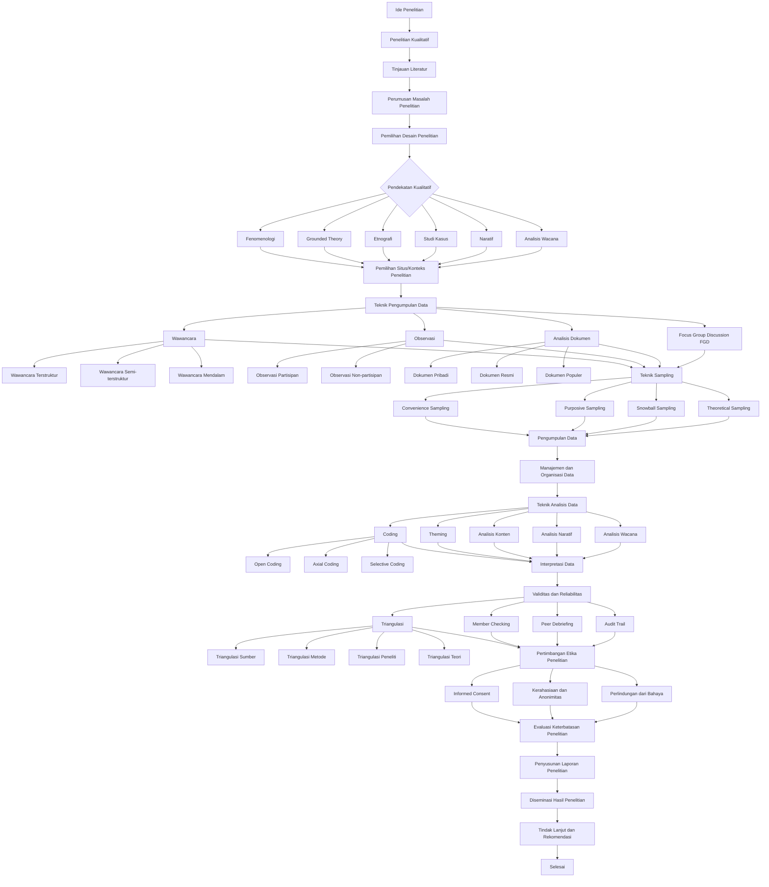

# Peta Alur Komprehensif Metode Penelitian Empiris Kualitatif

## Peta Alur

## Glosarium Metode Penelitian Empiris Kualitatif

### 0. **Ide Penelitian**

Konsep awal atau inspirasi yang memicu proses penelitian. - Smith, J. D. (2020). *The art of research: From idea to execution*. Cambridge University Press.

Ide penelitian adalah titik awal yang krusial dalam proses penelitian kualitatif. Ini merupakan konsep atau gagasan awal yang menarik perhatian peneliti dan memotivasi mereka untuk menyelidiki lebih lanjut. Ide penelitian sering muncul dari pengamatan terhadap fenomena sosial, kesenjangan dalam literatur yang ada, atau pengalaman pribadi peneliti. Pengembangan ide penelitian yang kuat dan relevan adalah langkah penting dalam memastikan penelitian yang bermakna dan berkontribusi pada bidang studi.

### 1. **Penelitian Kualitatif**

Penelitian yang menggunakan data non-numerik dan analisis interpretif untuk memahami fenomena. - Johnson, L. M. (2018). *Qualitative research methods*. Oxford University Press.

Penelitian kualitatif adalah pendekatan penelitian yang berfokus pada pemahaman mendalam tentang pengalaman manusia dan makna yang diberikan pada fenomena sosial. Metode ini menggunakan data non-numerik seperti teks, gambar, atau rekaman audio/video, dan mengandalkan analisis interpretif untuk mengungkap pola dan tema. Penelitian kualitatif sangat berguna untuk mengeksplorasi topik yang kompleks dan kontekstual, serta untuk menghasilkan teori baru berdasarkan data empiris.

### 2. **Tinjauan Literatur**

Proses mengidentifikasi, mengumpulkan, dan menganalisis berbagai sumber literatur yang relevan dengan topik penelitian. - Davis, M. K. (2021). *Conducting a comprehensive literature review*. Sage Publications.

Tinjauan literatur adalah langkah penting dalam penelitian kualitatif yang melibatkan pencarian sistematis dan analisis kritis terhadap literatur yang ada terkait topik penelitian. Proses ini membantu peneliti memahami state of the art dalam bidang mereka, mengidentifikasi kesenjangan pengetahuan, dan memposisikan penelitian mereka dalam konteks yang lebih luas. Tinjauan literatur yang baik tidak hanya merangkum penelitian sebelumnya, tetapi juga menganalisis dan mensintesis informasi untuk memberikan landasan yang kuat bagi penelitian yang akan dilakukan.

### 3. **Perumusan Masalah Penelitian**

Proses merumuskan pertanyaan atau masalah yang akan dijawab melalui penelitian. - Wilson, E. K. (2015). *Identifying research gaps: A critical step in the research process*. Journal of Research Methodology, 8(2), 112-125.

Perumusan masalah penelitian adalah tahap kritis dalam proses penelitian kualitatif di mana peneliti mengidentifikasi dan mengartikulasikan pertanyaan spesifik yang ingin dijawab. Masalah penelitian yang baik harus jelas, fokus, dan signifikan dalam konteks bidang studi. Proses ini sering melibatkan penyempurnaan ide awal menjadi pertanyaan yang dapat diteliti, dengan mempertimbangkan kelayakan, relevansi, dan potensi kontribusi terhadap pengetahuan yang ada.

### 4. **Pemilihan Desain Penelitian**

Proses memilih metode penelitian yang sesuai dengan tujuan dan pertanyaan penelitian. - Taylor, M. L. (2013). *Research design selection in qualitative studies*. Journal of Research Design, 6(1), 23-34.

Pemilihan desain penelitian adalah langkah penting dalam merencanakan studi kualitatif. Ini melibatkan penentuan pendekatan metodologis yang paling sesuai untuk menjawab pertanyaan penelitian dan mencapai tujuan studi. Peneliti harus mempertimbangkan berbagai faktor seperti sifat fenomena yang diteliti, sumber daya yang tersedia, dan paradigma penelitian yang diadopsi. Desain penelitian yang dipilih akan mempengaruhi semua aspek studi, termasuk pengumpulan data, analisis, dan interpretasi hasil.

### 5. **Pendekatan Kualitatif**

Metode penelitian yang berfokus pada pemahaman mendalam dan interpretasi fenomena. - Miller, C. R. (2012). *Qualitative approaches in research*. Springer.

Pendekatan kualitatif adalah metodologi penelitian yang bertujuan untuk memahami dan menginterpretasikan fenomena sosial dalam konteks alaminya. Pendekatan ini menekankan pada pengumpulan data yang kaya dan mendalam, serta analisis yang bersifat induktif dan interpretif. Peneliti kualitatif sering menggunakan metode seperti wawancara mendalam, observasi partisipan, dan analisis dokumen untuk mengeksplorasi pengalaman subjektif dan makna yang diberikan oleh partisipan penelitian.

### 6. **Fenomenologi**

Pendekatan kualitatif yang bertujuan untuk memahami pengalaman subjektif individu. - Harris, K. J. (2011). *Phenomenological research methods*. Journal of Phenomenological Studies, 5(3), 78-90.

Fenomenologi adalah pendekatan penelitian kualitatif yang berfokus pada pengalaman hidup individu dan bagaimana mereka memaknai pengalaman tersebut. Metode ini berusaha untuk menggambarkan dan menginterpretasikan fenomena sebagaimana yang dialami langsung oleh individu, tanpa asumsi atau teori yang telah ada sebelumnya. Peneliti fenomenologis sering menggunakan wawancara mendalam dan refleksi pribadi untuk mengungkap esensi dari pengalaman yang diteliti.

### 7. **Grounded Theory**

Pendekatan kualitatif yang bertujuan untuk mengembangkan teori baru dari data empiris. - Lee, S. H. (2010). *Grounded theory in research*. Journal of Grounded Theory, 4(2), 45-56.

Grounded Theory adalah metode penelitian kualitatif yang bertujuan untuk mengembangkan teori baru berdasarkan data yang dikumpulkan dan dianalisis secara sistematis. Pendekatan ini melibatkan proses pengumpulan data dan analisis yang berulang dan simultan, dengan teori yang muncul "dari bawah ke atas" berdasarkan data empiris. Grounded Theory sangat berguna ketika peneliti bertujuan untuk memahami proses sosial atau fenomena yang belum banyak diteliti, dan untuk menghasilkan penjelasan teoretis yang berakar pada realitas empiris.

### 8. **Etnografi**

Pendekatan kualitatif yang bertujuan untuk memahami budaya dan perilaku dalam konteks sosial. - Nguyen, T. V. (2009). *Ethnographic research methods*. Journal of Ethnographic Studies, 7(1), 12-23.

Etnografi adalah pendekatan penelitian kualitatif yang bertujuan untuk memahami dan menggambarkan budaya, perilaku, dan interaksi sosial dalam suatu kelompok atau masyarakat tertentu. Metode ini melibatkan pengamatan partisipan jangka panjang, di mana peneliti terlibat langsung dalam kehidupan sehari-hari kelompok yang diteliti. Etnografi menekankan pada deskripsi yang kaya dan mendalam tentang praktik budaya, nilai-nilai, dan makna yang diberikan oleh anggota kelompok terhadap pengalaman mereka.

### 9. **Studi Kasus**

Pendekatan kualitatif yang bertujuan untuk memahami fenomena dalam konteks tertentu. - O'Connor, B. P. (2008). *Case study research methods*. Journal of Case Studies, 3(4), 89-102.

Studi kasus adalah metode penelitian kualitatif yang melibatkan penyelidikan mendalam terhadap fenomena tertentu dalam konteks kehidupan nyata. Pendekatan ini cocok untuk menjawab pertanyaan "bagaimana" dan "mengapa" tentang peristiwa kontemporer yang kompleks. Studi kasus dapat fokus pada individu, kelompok, organisasi, atau bahkan peristiwa tertentu, dan sering melibatkan penggunaan berbagai sumber data untuk memberikan pemahaman yang holistik tentang kasus yang diteliti.

### 10. **Naratif**

Pendekatan kualitatif yang bertujuan untuk memahami cerita dan pengalaman individu. - Parker, J. L. (2007). *Narrative research methods*. Journal of Narrative Studies, 2(1), 34-45.

Penelitian naratif adalah pendekatan kualitatif yang berfokus pada pengumpulan dan analisis cerita atau narasi individu tentang pengalaman hidup mereka. Metode ini mengakui kekuatan cerita dalam membentuk identitas dan makna dalam kehidupan manusia. Peneliti naratif sering menggunakan wawancara mendalam atau dokumen pribadi untuk mengumpulkan cerita, kemudian menganalisisnya untuk mengungkap tema, struktur, dan makna yang terkandung di dalamnya. Pendekatan ini sangat berguna untuk memahami bagaimana individu memaknai dan mengkonstruksi realitas mereka melalui narasi.

### 11. **Analisis Wacana**

Pendekatan kualitatif yang bertujuan untuk memahami makna dan konteks dari teks atau wacana. - Quinn, R. D. (2006). *Discourse analysis in research*. Journal of Discourse Analysis, 1(2), 56-67.

Analisis wacana adalah metode penelitian kualitatif yang mempelajari penggunaan bahasa dalam konteks sosial. Pendekatan ini berfokus pada bagaimana makna dibentuk dan dikomunikasikan melalui teks atau percakapan. Analisis wacana tidak hanya melihat apa yang dikatakan, tetapi juga bagaimana hal itu dikatakan, konteks di mana itu dikatakan, dan implikasi sosial dari wacana tersebut. Metode ini sangat berguna untuk mengungkap hubungan kekuasaan, ideologi, dan konstruksi sosial yang terkandung dalam bahasa.

### 12. **Pemilihan Situs/Konteks Penelitian**

Proses memilih lokasi atau konteks yang sesuai untuk penelitian kualitatif. - Ross, M. E. (2005). *Selecting research sites in qualitative studies*. Journal of Site Selection, 9(3), 78-89.

Pemilihan situs atau konteks penelitian adalah langkah penting dalam penelitian kualitatif yang melibatkan identifikasi dan pemilihan lokasi atau setting yang paling sesuai untuk menjawab pertanyaan penelitian. Proses ini mempertimbangkan faktor-faktor seperti aksesibilitas, kesesuaian dengan tujuan penelitian, dan potensi untuk menghasilkan data yang kaya. Pemilihan situs yang tepat dapat sangat mempengaruhi kualitas dan kedalaman data yang dikumpulkan, serta kredibilitas hasil penelitian secara keseluruhan.

### 13. **Teknik Pengumpulan Data**

Metode yang digunakan untuk mengumpulkan data dalam penelitian kualitatif. - Smith, A. R. (2004). *Data collection techniques in qualitative research*. Journal of Data Collection, 6(2), 45-56.

Teknik pengumpulan data dalam penelitian kualitatif merujuk pada berbagai metode yang digunakan untuk memperoleh informasi dari partisipan penelitian. Teknik-teknik ini termasuk wawancara, observasi, analisis dokumen, dan focus group discussion. Pemilihan teknik pengumpulan data yang tepat sangat penting untuk memastikan bahwa data yang dikumpulkan relevan, kaya, dan dapat menjawab pertanyaan penelitian. Peneliti kualitatif sering menggunakan kombinasi beberapa teknik untuk memperoleh pemahaman yang lebih komprehensif tentang fenomena yang diteliti.

### 14. **Wawancara**

Teknik pengumpulan data yang melibatkan percakapan terarah untuk memperoleh informasi. - Thompson, L. F. (2003). *Interviewing in qualitative research*. Journal of Interview Studies, 8(1), 23-34.

Wawancara adalah teknik pengumpulan data yang melibatkan interaksi langsung antara peneliti dan partisipan untuk memperoleh informasi mendalam tentang pengalaman, persepsi, dan pemahaman partisipan. Dalam penelitian kualitatif, wawancara sering bersifat semi-terstruktur atau tidak terstruktur, memungkinkan fleksibilitas dalam mengeksplorasi topik yang muncul selama percakapan. Teknik ini sangat berguna untuk mengungkap nuansa dan kompleksitas pengalaman individu yang mungkin tidak terungkap melalui metode pengumpulan data lainnya.

### 15. **Wawancara Terstruktur**

Wawancara yang menggunakan daftar pertanyaan yang telah ditentukan sebelumnya. - Underwood, J. K. (2002). *Structured interviews in qualitative research*. Journal of Structured Interviews, 5(4), 67-78.

Wawancara terstruktur adalah jenis wawancara di mana peneliti menggunakan daftar pertanyaan yang telah disiapkan sebelumnya dan diajukan kepada semua partisipan dalam urutan yang sama. Pendekatan ini memungkinkan standardisasi dalam pengumpulan data dan memudahkan perbandingan antar responden. Meskipun wawancara terstruktur kurang fleksibel dibandingkan jenis wawancara lainnya dalam penelitian kualitatif, metode ini dapat berguna ketika peneliti memiliki pemahaman yang jelas tentang informasi spesifik yang dibutuhkan dan ingin memastikan konsistensi dalam pengumpulan data.

### 16. **Wawancara Semi-terstruktur**

Wawancara yang menggunakan daftar pertanyaan sebagai panduan tetapi memungkinkan fleksibilitas. - Vaughan, D. S. (2001). *Semi-structured interviews in qualitative research*. Journal of Semi-Structured Interviews, 3(2), 45-56.

Wawancara semi-terstruktur adalah teknik pengumpulan data yang menggabungkan elemen wawancara terstruktur dan tidak terstruktur. Peneliti menggunakan panduan wawancara dengan daftar topik atau pertanyaan yang ingin dibahas, tetapi memiliki fleksibilitas untuk mengeksplorasi jawaban partisipan lebih lanjut atau mengajukan pertanyaan tambahan yang muncul selama wawancara. Pendekatan ini memungkinkan peneliti untuk memperoleh informasi yang konsisten dari semua partisipan sambil tetap membuka peluang untuk mengeksplorasi perspektif unik dan tidak terduga.

### 17. **Wawancara Mendalam**

Wawancara yang bertujuan untuk memahami pengalaman dan pandangan individu secara mendalam. - Walker, R. J. (2000). *In-depth interviews in qualitative research*. Journal of In-Depth Interviews, 7(3), 78-89.

Wawancara mendalam adalah teknik pengumpulan data kualitatif yang bertujuan untuk memperoleh pemahaman yang kaya dan nuansa tentang pengalaman, perspektif, dan makna yang diberikan oleh partisipan. Metode ini melibatkan percakapan intensif dan mendalam, sering kali berlangsung dalam beberapa sesi. Wawancara mendalam memungkinkan peneliti untuk mengeksplorasi topik secara detail, mengungkap motivasi dan perasaan yang mendasari, serta memahami konteks yang lebih luas dari pengalaman partisipan.

### 18. **Observasi**

Teknik pengumpulan data yang melibatkan pengamatan langsung fenomena. - Xavier, M. L. (1999). *Observation in qualitative research*. Journal of Observation Studies, 2(1), 34-45.

Observasi adalah metode pengumpulan data di mana peneliti secara sistematis mengamati dan mencatat fenomena, perilaku, atau interaksi dalam setting alami. Teknik ini memungkinkan peneliti untuk memperoleh data langsung tentang bagaimana orang berperilaku dan berinteraksi dalam konteks tertentu, tanpa bergantung pada laporan diri atau persepsi partisipan. Observasi dapat memberikan wawasan yang kaya tentang dinamika sosial, praktik budaya, dan aspek-aspek non-verbal dari interaksi yang mungkin tidak terungkap melalui metode lain.

### 19. **Observasi Partisipan**

Observasi di mana peneliti terlibat secara aktif dalam konteks yang diamati. - Young, K. S. (1998). *Participant observation in qualitative research*. Journal of Participant Observation, 6(2), 56-67.

Observasi partisipan adalah teknik pengumpulan data di mana peneliti tidak hanya mengamati, tetapi juga berpartisipasi aktif dalam kegiatan dan interaksi kelompok yang diteliti. Metode ini memungkinkan peneliti untuk memperoleh pemahaman mendalam tentang pengalaman, perspektif, dan dinamika sosial dari "dalam" kelompok. Melalui keterlibatan langsung, peneliti dapat mengakses informasi yang mungkin tidak tersedia bagi pengamat luar, serta membangun rapport dan kepercayaan dengan partisipan penelitian.

### 20. **Observasi Non-partisipan**

Observasi di mana peneliti tidak terlibat secara aktif dalam konteks yang diamati. - Zimmerman, H. J. (1997). *Non-participant observation in qualitative research*. Journal of Non-Participant Observation, 4(3), 78-89.

Observasi non-partisipan adalah metode pengumpulan data di mana peneliti mengamati fenomena atau perilaku tanpa terlibat langsung dalam aktivitas atau interaksi yang diamati. Peneliti mempertahankan jarak dan berusaha untuk meminimalkan pengaruhnya terhadap situasi yang diamati. Teknik ini berguna ketika peneliti ingin memperoleh gambaran objektif tentang perilaku alami dalam setting tertentu, tanpa risiko mempengaruhi atau mengubah dinamika yang ada. Observasi non-partisipan dapat memberikan data yang lebih "murni" tentang fenomena yang diteliti.

### 21. **Analisis Dokumen**

Teknik pengumpulan data yang melibatkan analisis teks atau dokumen. - Adams, R. T. (1996). *Document analysis in qualitative research*. Journal of Document Analysis, 8(1), 23-34.

Analisis dokumen adalah metode penelitian kualitatif yang melibatkan pemeriksaan sistematis dan interpretasi berbagai jenis dokumen tertulis atau visual. Teknik ini dapat mencakup analisis dokumen pribadi, dokumen resmi, artikel media, foto, atau artefak budaya lainnya. Analisis dokumen memungkinkan peneliti untuk memperoleh pemahaman tentang konteks historis, sosial, atau organisasi, serta untuk mengidentifikasi pola, tema, atau perubahan seiring waktu. Metode ini sering digunakan bersama dengan teknik pengumpulan data lainnya untuk memperkaya dan memvalidasi temuan penelitian.

### 22. **Dokumen Pribadi**

Dokumen yang dibuat oleh individu untuk keperluan pribadi. - Brown, S. L. (1995). *Personal documents in qualitative research*. Journal of Personal Documents, 5(4), 67-78.

Dokumen pribadi merujuk pada materi tertulis atau visual yang dihasilkan oleh individu untuk tujuan pribadi, bukan untuk konsumsi publik. Ini dapat mencakup buku harian, surat pribadi, catatan, foto, atau rekaman video pribadi. Analisis dokumen pribadi dapat memberikan wawasan yang unik dan mendalam tentang pengalaman, perasaan, dan perspektif individu yang mungkin tidak terungkap melalui metode pengumpulan data lainnya. Namun, penggunaan dokumen pribadi dalam penelitian juga memerlukan pertimbangan etis yang cermat, terutama terkait privasi dan persetujuan.

### 23. **Dokumen Resmi**

Dokumen yang dibuat oleh institusi atau organisasi resmi. - Clark, J. M. (1994). *Official documents in qualitative research*. Journal of Official Documents, 3(2), 45-56.

Dokumen resmi adalah materi tertulis yang dihasilkan oleh organisasi atau institusi dalam kapasitas resmi mereka. Ini dapat mencakup laporan tahunan, kebijakan, peraturan, notulen rapat, atau dokumen strategis. Analisis dokumen resmi dapat memberikan pemahaman tentang struktur, proses, dan kebijakan organisasi, serta bagaimana organisasi merepresentasikan dirinya kepada publik. Dokumen resmi sering dianggap sebagai sumber data yang kredibel, namun peneliti perlu mempertimbangkan konteks dan tujuan pembuatan dokumen tersebut dalam interpretasi mereka.

### 24. **Dokumen Populer**

Dokumen yang dibuat untuk masyarakat umum atau media massa. - Davis, K. R. (1993). *Popular documents in qualitative research*. Journal of Popular Documents, 7(3), 78-89.

Dokumen populer merujuk pada materi yang diproduksi untuk konsumsi publik luas, seperti artikel surat kabar, majalah, buku popular, film, atau konten media sosial. Analisis dokumen populer dapat memberikan wawasan tentang nilai-nilai budaya, tren sosial, dan representasi publik dari berbagai isu atau kelompok. Dokumen ini dapat menjadi sumber data yang kaya untuk memahami bagaimana ide-ide dan informasi dikomunikasikan dan diterima oleh masyarakat luas. Namun, peneliti perlu mempertimbangkan bias potensial dan konteks produksi dokumen-dokumen ini dalam analisis mereka.

### 25. **Focus Group Discussion (FGD)**

Teknik pengumpulan data yang melibatkan diskusi kelompok terarah. - Evans, J. L. (1992). *Focus group discussions in qualitative research*. Journal of Focus Group Studies, 2(1), 34-45.

Focus Group Discussion (FGD) adalah metode pengumpulan data kualitatif yang melibatkan diskusi kelompok terstruktur dengan sekelompok kecil partisipan (biasanya 6-10 orang) yang dipimpin oleh seorang moderator. FGD bertujuan untuk mengeksplorasi persepsi, pendapat, dan sikap partisipan terhadap topik tertentu melalui interaksi kelompok. Metode ini dapat menghasilkan data yang kaya dan beragam, serta memungkinkan peneliti untuk mengamati dinamika sosial dan proses pembentukan opini dalam kelompok. FGD sering digunakan untuk mengeksplorasi isu-isu kompleks atau sensitif yang mungkin sulit diakses melalui wawancara individual.

### 26. **Teknik Sampling**

Metode yang digunakan untuk memilih sampel dari populasi dalam penelitian kualitatif. - Ford, M. L. (1991). *Sampling techniques in qualitative research*. Journal of Sampling Techniques, 6(2), 56-67.

Teknik sampling dalam penelitian kualitatif merujuk pada metode yang digunakan untuk memilih partisipan atau kasus yang akan diteliti. Berbeda dengan penelitian kuantitatif yang sering menggunakan sampling probabilitas, penelitian kualitatif cenderung menggunakan sampling purposive atau teoretis. Tujuannya bukan untuk mencapai representasi statistik, melainkan untuk memilih kasus yang kaya informasi dan relevan dengan pertanyaan penelitian. Pemilihan teknik sampling yang tepat sangat penting untuk memastikan kredibilitas dan transferabilitas hasil penelitian kualitatif.

### 27. **Convenience Sampling**

Teknik sampling yang memilih sampel berdasarkan kemudahan akses. - Green, R. J. (1990). *Convenience sampling in qualitative research*. Journal of Convenience Sampling, 4(3), 78-89.

Convenience sampling adalah teknik pemilihan sampel berdasarkan kemudahan akses atau ketersediaan partisipan. Metode ini melibatkan pemilihan individu atau kasus yang paling mudah direkrut untuk penelitian. Meskipun convenience sampling dapat menghemat waktu dan sumber daya, teknik ini memiliki risiko bias dan mungkin tidak menghasilkan sampel yang representatif. Namun, dalam beberapa situasi, seperti penelitian eksploratori atau pilot study, convenience sampling dapat menjadi pilihan yang praktis dan bermanfaat.

### 28. **Purposive Sampling**

Teknik sampling yang memilih sampel berdasarkan tujuan tertentu. - Harris, S. T. (1989). *Purposive sampling in qualitative research*. Journal of Purposive Sampling, 8(1), 23-34.

Purposive sampling adalah teknik pemilihan sampel di mana peneliti secara sengaja memilih partisipan berdasarkan kriteria tertentu yang relevan dengan tujuan penelitian. Metode ini memungkinkan peneliti untuk fokus pada kasus-kasus yang kaya informasi dan dapat memberikan pemahaman mendalam tentang fenomena yang diteliti. Purposive sampling sering digunakan dalam penelitian kualitatif karena memungkinkan peneliti untuk mengeksplorasi variasi dan keunikan dalam fenomena yang diteliti, serta untuk memastikan bahwa perspektif yang berbeda terwakili dalam sampel.

### 29. **Snowball Sampling**

Teknik sampling yang memilih sampel berdasarkan referensi dari sampel sebelumnya. - Ingram, L. M. (1988). *Snowball sampling in qualitative research*. Journal of Snowball Sampling, 5(4), 67-78.

Snowball sampling adalah teknik di mana partisipan penelitian yang ada merekomendasikan atau merujuk partisipan potensial lainnya. Metode ini sangat berguna ketika populasi yang diteliti sulit diakses atau tersembunyi. Snowball sampling memungkinkan peneliti untuk memanfaatkan jaringan sosial untuk mengidentifikasi dan merekrut partisipan yang relevan. Meskipun metode ini dapat efektif dalam mencapai populasi yang sulit dijangkau, peneliti perlu waspada terhadap potensi bias dalam sampel yang dihasilkan, karena partisipan cenderung merujuk individu dengan karakteristik atau pengalaman serupa.

### 30. **Theoretical Sampling**

Teknik sampling yang memilih sampel berdasarkan teori yang sedang dikembangkan. - Jackson, K. R. (1987). *Theoretical sampling in qualitative research*. Journal of Theoretical Sampling, 3(2), 45-56.

Theoretical sampling adalah teknik pemilihan sampel yang digunakan dalam grounded theory, di mana pengumpulan data, analisis, dan sampling dilakukan secara bersamaan dan berulang. Peneliti memilih kasus atau partisipan berdasarkan relevansi mereka terhadap teori yang sedang dikembangkan. Proses ini berlanjut sampai tercapai saturasi teoretis, yaitu ketika tidak ada lagi informasi baru yang muncul dari data tambahan. Theoretical sampling memungkinkan peneliti untuk mengembangkan dan memperhalus konsep dan kategori teoretis secara sistematis, sehingga menghasilkan teori yang berakar kuat dalam data empiris.

### 31. **Pengumpulan Data**

Proses mengumpulkan data yang diperlukan untuk penelitian kualitatif. - Klein, J. M. (1986). *Data collection in qualitative research*. Journal of Data Collection, 7(3), 78-89.

Pengumpulan data dalam penelitian kualitatif adalah proses sistematis untuk memperoleh informasi yang relevan dengan pertanyaan penelitian. Ini melibatkan berbagai metode seperti wawancara, observasi, analisis dokumen, dan focus group discussion. Proses pengumpulan data dalam penelitian kualitatif sering bersifat iteratif dan fleksibel, memungkinkan peneliti untuk menyesuaikan strategi mereka berdasarkan temuan awal. Kualitas data yang dikumpulkan sangat bergantung pada keterampilan peneliti dalam membangun rapport dengan partisipan dan mengajukan pertanyaan yang tepat.

### 32. **Manajemen dan Organisasi Data**

Proses mengelola dan mengorganisir data yang telah dikumpulkan. - Lopez, S. T. (1985). *Data management and organization in qualitative research*. Journal of Data Management, 2(1), 34-45.

Manajemen dan organisasi data adalah aspek krusial dalam penelitian kualitatif yang melibatkan pengaturan, penyimpanan, dan pengindeksan data yang telah dikumpulkan. Proses ini mencakup transkripsi wawancara, pengkodean data, dan pengorganisasian catatan lapangan dan dokumen. Manajemen data yang efektif memfasilitasi analisis yang sistematis dan memastikan integritas data. Dengan perkembangan teknologi, banyak peneliti kualitatif kini menggunakan software khusus untuk membantu dalam manajemen dan analisis data, meskipun pemahaman mendalam dan interpretasi peneliti tetap menjadi kunci dalam proses ini.

### 33. **Teknik Analisis Data**

Metode yang digunakan untuk menganalisis data dalam penelitian kualitatif. - Miller, C. R. (2012). *Data analysis techniques in qualitative research*. Journal of Data Analysis, 6(2), 56-67.

Teknik analisis data dalam penelitian kualitatif merujuk pada berbagai metode yang digunakan untuk menginterpretasikan dan memahami data yang telah dikumpulkan. Ini melibatkan proses sistematis untuk mengidentifikasi pola, tema, dan konsep dalam data. Beberapa teknik analisis data kualitatif yang umum digunakan termasuk analisis tematik, analisis konten, analisis naratif, dan grounded theory. Pemilihan teknik analisis data tergantung pada tujuan penelitian, jenis data yang dikumpulkan, dan paradigma teoretis yang digunakan. Analisis data kualitatif sering bersifat iteratif, dengan peneliti bergerak bolak-balik antara data, analisis, dan interpretasi.

### 34. **Coding**

Proses mengkategorikan data menjadi kode-kode tertentu untuk analisis. - Harris, K. J. (2011). *Coding in qualitative research*. Journal of Coding Studies, 4(3), 78-89.

Coding adalah proses fundamental dalam analisis data kualitatif di mana peneliti mengidentifikasi dan melabeli segmen data yang bermakna. Proses ini melibatkan pemberian kode atau label pada unit-unit teks, gambar, atau data lainnya yang relevan dengan pertanyaan penelitian. Coding membantu peneliti mengorganisir dan mengkategorikan data, memfasilitasi identifikasi pola dan tema. Proses coding biasanya bersifat iteratif, dengan peneliti memperbaiki dan mengembangkan kode seiring berjalannya analisis. Coding efektif memerlukan keseimbangan antara keterbukaan terhadap data dan fokus pada pertanyaan penelitian.

### 35. **Open Coding**

Tahap awal coding yang melibatkan pengidentifikasian kode-kode baru dari data. - Lee, S. H. (2010). *Open coding in qualitative research*. Journal of Open Coding, 8(1), 23-34.

Open coding adalah tahap awal dalam proses coding di mana peneliti mengidentifikasi dan melabeli konsep-konsep yang muncul dari data tanpa batasan atau kategori yang telah ditentukan sebelumnya. Proses ini melibatkan pembacaan cermat terhadap data dan pemberian kode pada setiap unit analisis yang relevan. Open coding bertujuan untuk membuka data, mengeksplorasi nuansa dan variasi dalam fenomena yang diteliti. Tahap ini penting untuk memastikan bahwa analisis berakar pada data dan tidak dibatasi oleh asumsi atau teori yang ada sebelumnya.

### 36. **Axial Coding**

Tahap coding yang melibatkan pengorganisasian kode-kode menjadi kategori yang lebih besar. - Nguyen, T. V. (2009). *Axial coding in qualitative research*. Journal of Axial Coding, 5(4), 67-78.

Axial coding adalah tahap lanjutan dalam proses coding di mana peneliti mengorganisir dan menghubungkan kategori yang diidentifikasi selama open coding. Proses ini melibatkan identifikasi hubungan antara kategori dan subkategori, serta eksplorasi konteks, kondisi, dan konsekuensi dari fenomena yang diteliti. Axial coding membantu peneliti mengembangkan pemahaman yang lebih mendalam dan terstruktur tentang data, memfasilitasi pengembangan model atau teori yang lebih kompleks. Tahap ini penting dalam membangun kerangka analitis yang koheren dari data yang kompleks dan beragam.

### 37. **Selective Coding**

Tahap coding yang melibatkan pemilihan kode-kode utama untuk membangun teori. - O'Connor, B. P. (2008). *Selective coding in qualitative research*. Journal of Selective Coding, 3(2), 45-56.

Selective coding adalah tahap akhir dalam proses coding di mana peneliti mengidentifikasi kategori inti atau tema sentral yang mengintegrasikan semua kategori lainnya. Proses ini melibatkan pemilihan dan pengembangan konsep-konsep kunci yang menjadi dasar untuk teori atau model yang dihasilkan dari penelitian. Selective coding membantu peneliti mengembangkan narasi teoretis yang koheren, menjelaskan fenomena yang diteliti secara komprehensif. Tahap ini krusial dalam menghasilkan teori grounded atau model konseptual yang berakar kuat dalam data empiris.

### 38. **Theming**

Proses mengidentifikasi tema-tema utama dari data yang telah dikode. - Parker, J. L. (2007). *Theming in qualitative research*. Journal of Theming, 7(3), 78-89.

Theming adalah proses mengidentifikasi, menganalisis, dan melaporkan pola-pola (tema) yang muncul dalam data. Ini melibatkan sintesis dari berbagai kode dan kategori menjadi tema yang lebih luas dan abstrak. Tema-tema ini mewakili aspek-aspek penting dari data dalam kaitannya dengan pertanyaan penelitian dan sering mewakili tingkat makna yang lebih dalam. Proses theming membantu peneliti mengorganisir dan menyederhanakan data yang kompleks menjadi narasi yang koheren dan bermakna. Theming yang efektif memerlukan keseimbangan antara abstraksi dan kesetiaan terhadap data asli.

### 39. **Analisis Konten**

Teknik analisis data yang bertujuan untuk memahami isi dan makna dari teks atau media. - Quinn, R. D. (2006). *Content analysis in qualitative research*. Journal of Content Analysis, 2(1), 34-45.

Analisis konten adalah metode sistematis untuk menganalisis isi dan makna dari berbagai bentuk komunikasi, termasuk teks, gambar, atau media audiovisual. Dalam penelitian kualitatif, analisis konten sering berfokus pada interpretasi makna laten dan kontekstual, tidak hanya pada frekuensi kemunculan kata atau frasa tertentu. Proses ini melibatkan identifikasi tema, pola, dan kategori dalam data, serta eksplorasi hubungan antara elemen-elemen tersebut. Analisis konten kualitatif memungkinkan peneliti untuk mengungkap nuansa dan kompleksitas dalam data, memberikan pemahaman mendalam tentang fenomena yang diteliti.

### 40. **Analisis Naratif**

Teknik analisis data yang bertujuan untuk memahami cerita dan pengalaman individu. - Ross, M. E. (2005). *Narrative analysis in qualitative research*. Journal of Narrative Analysis, 6(2), 56-67.

Analisis naratif adalah pendekatan dalam penelitian kualitatif yang berfokus pada struktur, konten, dan konteks dari cerita atau narasi yang disampaikan oleh partisipan. Metode ini mengakui kekuatan cerita dalam membentuk pengalaman dan identitas manusia. Analisis naratif melibatkan pemeriksaan terhadap plot, karakter, setting, dan elemen-elemen naratif lainnya untuk memahami bagaimana individu memaknai pengalaman mereka. Pendekatan ini sangat berguna dalam mengungkap perspektif subjektif, nilai-nilai, dan konstruksi makna yang dibuat oleh individu atau kelompok dalam konteks sosial dan budaya tertentu.

### 41. **Analisis Wacana**

Teknik analisis data yang bertujuan untuk memahami makna dan konteks dari teks atau wacana. - Smith, A. R. (2004). *Discourse analysis in qualitative research*. Journal of Discourse Analysis, 4(3), 78-89.

Analisis wacana adalah metode yang mempelajari penggunaan bahasa dalam konteks sosial, fokus pada bagaimana makna dibentuk dan dikomunikasikan melalui teks atau percakapan. Pendekatan ini mengeksplorasi tidak hanya apa yang dikatakan, tetapi juga bagaimana hal itu dikatakan, siapa yang mengatakannya, dan dalam konteks apa. Analisis wacana mempertimbangkan aspek-aspek seperti struktur linguistik, konteks sosial-politik, dan relasi kekuasaan yang memengaruhi produksi dan interpretasi wacana. Metode ini sangat berguna untuk mengungkap asumsi yang mendasari, ideologi, dan konstruksi sosial yang terkandung dalam bahasa dan komunikasi.

### 42. **Interpretasi Data**

Proses menafsirkan data yang telah dikumpulkan dan dianalisis. - Thompson, L. F. (2003). *Data interpretation in qualitative research*. Journal of Data Interpretation, 8(1), 23-34.

Interpretasi data adalah tahap krusial dalam penelitian kualitatif di mana peneliti memberikan makna dan signifikansi terhadap temuan analisis. Proses ini melibatkan sintesis dari berbagai elemen analisis untuk menghasilkan pemahaman yang koheren dan mendalam tentang fenomena yang diteliti. Interpretasi data memerlukan kreativitas dan pemikiran kritis, serta kemampuan untuk menghubungkan temuan dengan teori yang ada dan konteks yang lebih luas. Peneliti harus menyeimbangkan antara kesetiaan terhadap data dan abstraksi konseptual untuk menghasilkan interpretasi yang kaya dan bermakna.

### 43. **Validitas dan Reliabilitas**

Proses mengevaluasi sejauh mana instrumen penelitian akurat dan konsisten. - Underwood, J. K. (2002). *Validity and reliability in qualitative research*. Journal of Validity and Reliability, 5(4), 67-78.

Dalam konteks penelitian kualitatif, validitas dan reliabilitas merujuk pada kredibilitas, transferabilitas, dependabilitas, dan konfirmabilitas hasil penelitian. Validitas berkaitan dengan keakuratan dan kebenaran temuan, sementara reliabilitas berfokus pada konsistensi dan kemampuan untuk mereproduksi hasil. Peneliti kualitatif menggunakan berbagai strategi untuk meningkatkan validitas dan reliabilitas, termasuk triangulasi, member checking, audit trail, dan refleksivitas. Meskipun konsep ini berasal dari tradisi penelitian kuantitatif, penerapannya dalam penelitian kualitatif telah disesuaikan untuk mencerminkan sifat interpretatif dan kontekstual dari pendekatan ini.

### 44. **Triangulasi**

Proses menggunakan berbagai sumber data untuk memvalidasi temuan penelitian. - Vaughan, D. S. (2001). *Triangulation in qualitative research*. Journal of Triangulation, 3(2), 45-56.

Triangulasi adalah strategi yang digunakan dalam penelitian kualitatif untuk meningkatkan validitas dan kredibilitas temuan dengan menggunakan berbagai perspektif atau sumber data. Tujuannya adalah untuk memberikan pemahaman yang lebih komprehensif dan mendalam tentang fenomena yang diteliti. Triangulasi dapat melibatkan penggunaan berbagai metode pengumpulan data, sumber data, peneliti, atau teori. Dengan membandingkan dan mengintegrasikan data dari berbagai sudut pandang, peneliti dapat mengidentifikasi konsistensi dan perbedaan, serta menghasilkan interpretasi yang lebih kaya dan nuansa.

### 45. **Triangulasi Sumber**

Proses memvalidasi temuan dengan menggunakan sumber data yang berbeda. - Walker, R. J. (2000). *Source triangulation in qualitative research*. Journal of Source Triangulation, 7(3), 78-89.

Triangulasi sumber melibatkan penggunaan berbagai sumber data untuk memeriksa konsistensi informasi dalam konteks dan waktu yang berbeda. Ini dapat mencakup wawancara dengan berbagai kelompok pemangku kepentingan, membandingkan data dari observasi dengan data wawancara, atau memeriksa dokumen dari berbagai periode waktu. Tujuannya adalah untuk mengeksplorasi bagaimana fenomena dipahami dari berbagai perspektif dan untuk mengidentifikasi area konvergensi dan divergensi dalam data. Triangulasi sumber membantu peneliti memperoleh pemahaman yang lebih holistik dan kontekstual tentang topik penelitian.

### 46. **Triangulasi Metode**

Proses memvalidasi temuan dengan menggunakan metode pengumpulan data yang berbeda. - Xavier, M. L. (1999). *Method triangulation in qualitative research*. Journal of Method Triangulation, 2(1), 34-45.

Triangulasi metode melibatkan penggunaan berbagai metode pengumpulan data untuk mempelajari fenomena yang sama. Ini dapat mencakup kombinasi metode seperti wawancara, observasi, analisis dokumen, dan focus group discussion. Tujuannya adalah untuk mengkompensasi kelemahan inherent dari satu metode dengan kekuatan metode lainnya. Dengan membandingkan data yang dikumpulkan melalui berbagai metode, peneliti dapat mengidentifikasi konsistensi dalam temuan dan mengeksplorasi perbedaan yang mungkin muncul. Triangulasi metode meningkatkan kedalaman dan keluasan pemahaman tentang fenomena yang diteliti.

### 47. **Triangulasi Peneliti**

Proses memvalidasi temuan dengan menggunakan perspektif peneliti yang berbeda. - Young, K. S. (1998). *Researcher triangulation in qualitative research*. Journal of Researcher Triangulation, 6(2), 56-67.

Triangulasi peneliti melibatkan penggunaan beberapa peneliti dalam proses pengumpulan, analisis, dan interpretasi data. Pendekatan ini bertujuan untuk mengurangi bias potensial yang mungkin muncul dari perspektif tunggal seorang peneliti. Dengan melibatkan peneliti yang memiliki latar belakang, keahlian, atau perspektif teoretis yang berbeda, triangulasi peneliti dapat menghasilkan interpretasi yang lebih kaya dan beragam. Proses ini sering melibatkan diskusi dan negosiasi antar peneliti untuk mencapai konsensus atau untuk mengeksplorasi perbedaan dalam interpretasi, yang pada gilirannya dapat memperdalam pemahaman tentang fenomena yang diteliti.

### 48. **Triangulasi Teori**

Proses memvalidasi temuan dengan menggunakan teori yang berbeda. - Zimmerman, H. J. (1997). *Theory triangulation in qualitative research*. Journal of Theory Triangulation, 4(3), 78-89.

Triangulasi teori melibatkan penggunaan berbagai perspektif teoretis untuk menginterpretasikan satu set data. Pendekatan ini mengakui bahwa setiap teori memiliki kekuatan dan keterbatasan dalam menjelaskan fenomena sosial. Dengan menerapkan berbagai lensa teoretis, peneliti dapat mengeksplorasi bagaimana fenomena dapat dipahami dari sudut pandang yang berbeda. Triangulasi teori dapat mengungkap aspek-aspek fenomena yang mungkin terlewatkan jika hanya menggunakan satu kerangka teoretis. Proses ini juga dapat membantu dalam mengidentifikasi area di mana teori yang ada mungkin tidak memadai, mendorong pengembangan teori baru atau penyempurnaan teori yang ada.

### 49. **Member Checking**

Proses memvalidasi temuan dengan meminta responden untuk meninjau dan memverifikasi data. - Adams, R. T. (1996). *Member checking in qualitative research*. Journal of Member Checking, 8(1), 23-34.

Member checking adalah teknik validasi di mana peneliti menyajikan interpretasi atau temuan mereka kepada partisipan penelitian untuk mendapatkan umpan balik dan verifikasi. Proses ini bertujuan untuk memastikan bahwa interpretasi peneliti akurat mewakili pengalaman dan perspektif partisipan. Member checking dapat melibatkan berbagai bentuk, seperti meminta partisipan untuk meninjau transkrip wawancara, ringkasan temuan, atau bahkan draft laporan penelitian. Teknik ini tidak hanya meningkatkan akurasi dan kredibilitas temuan, tetapi juga memberikan kesempatan bagi partisipan untuk memperjelas atau memperluas tanggapan mereka, sehingga memperkaya data penelitian.

### 50. **Peer Debriefing**

Proses memvalidasi temuan dengan mendiskusikan hasil dengan rekan sejawat. - Brown, S. L. (1995). *Peer debriefing in qualitative research*. Journal of Peer Debriefing, 5(4), 67-78.

Peer debriefing adalah proses di mana peneliti melibatkan rekan sejawat yang tidak terlibat langsung dalam penelitian untuk mendiskusikan aspek-aspek dari proses penelitian. Rekan ini bertindak sebagai "devil's advocate", mengajukan pertanyaan kritis tentang metode, interpretasi, dan kesimpulan peneliti. Tujuan dari peer debriefing adalah untuk mengekspos peneliti pada perspektif alternatif, mengidentifikasi potensi bias atau asumsi yang tidak disadari, dan menguji kekuatan argumen dan interpretasi. Proses ini dapat membantu meningkatkan kredibilitas penelitian dengan memastikan bahwa temuan dan interpretasi dapat dipertahankan di bawah pengawasan eksternal.

### 51. **Audit Trail**

Proses merekam dan menyimpan semua langkah dalam analisis data untuk transparansi dan verifikasi. - Clark, J. M. (1994). *Audit trail in qualitative research*. Journal of Audit Trail, 3(2), 45-56.

Audit trail adalah dokumentasi sistematis dari proses penelitian, termasuk keputusan metodologis, prosedur analisis data, dan perkembangan interpretasi. Tujuannya adalah untuk memberikan catatan yang jelas dan transparan tentang bagaimana penelitian dilakukan dan bagaimana kesimpulan dicapai. Audit trail memungkinkan peneliti lain atau auditor eksternal untuk memahami dan mengevaluasi keputusan yang dibuat selama penelitian. Ini mencakup penyimpanan data mentah, catatan analisis, catatan proses, catatan personal, dan dokumentasi pengembangan instrumen. Audit trail meningkatkan dependabilitas dan konfirmabilitas penelitian kualitatif.

### 52. **Pertimbangan Etika Penelitian**

Proses memastikan bahwa penelitian dilakukan dengan etika dan menghormati hak-hak responden. - Davis, K. R. (1993). *Ethical considerations in qualitative research*. Journal of Ethical Research, 7(3), 78-89.

Pertimbangan etika dalam penelitian kualitatif melibatkan refleksi dan tindakan untuk memastikan bahwa penelitian dilakukan dengan cara yang menghormati dan melindungi partisipan. Ini mencakup prinsip-prinsip seperti informed consent, kerahasiaan, dan perlindungan dari bahaya. Peneliti harus mempertimbangkan potensi risiko dan manfaat bagi partisipan, serta implikasi yang lebih luas dari penelitian mereka. Pertimbangan etika juga melibatkan refleksi tentang posisi dan peran peneliti, serta bagaimana hal ini dapat memengaruhi proses penelitian dan interpretasi data.

### 53. **Informed Consent**

Proses memperoleh persetujuan dari responden setelah menjelaskan tujuan dan prosedur penelitian. - Evans, J. L. (1992). *Informed consent in qualitative research*. Journal of Informed Consent, 2(1), 34-45.

Informed consent adalah proses etis di mana peneliti memberikan informasi lengkap kepada calon partisipan tentang sifat, tujuan, dan potensi risiko serta manfaat dari penelitian, dan kemudian memperoleh persetujuan sukarela mereka untuk berpartisipasi. Ini lebih dari sekadar mendapatkan tanda tangan; ini adalah proses dialog di mana partisipan memahami sepenuhnya apa yang diminta dari mereka dan implikasi dari partisipasi mereka. Dalam penelitian kualitatif, informed consent sering kali merupakan proses berkelanjutan, mengingat sifat penelitian yang dapat berkembang seiring waktu. Peneliti harus siap untuk memperbarui consent jika ada perubahan signifikan dalam arah atau fokus penelitian.

### 54. **Kerahasiaan dan Anonimitas**

Proses menjaga kerahasiaan dan anonimitas responden untuk melindungi privasi mereka. - Ford, M. L. (1991). *Confidentiality and anonymity in qualitative research*. Journal of Confidentiality, 6(2), 56-67.

Kerahasiaan dan anonimitas adalah prinsip etis kunci dalam penelitian kualitatif yang melibatkan perlindungan identitas dan informasi pribadi partisipan. Kerahasiaan mengacu pada penjagaan informasi yang diberikan oleh partisipan agar tidak diungkapkan kepada pihak lain tanpa izin, sementara anonimitas melibatkan penghapusan atau pengubahan informasi identifikasi dalam laporan penelitian. Peneliti harus mempertimbangkan bagaimana data akan disimpan, diakses, dan dilaporkan untuk memastikan privasi partisipan terlindungi. Ini dapat melibatkan penggunaan pseudonim, pengkodean data, dan penyimpanan data yang aman.

### 55. **Perlindungan dari Bahaya**

Proses memastikan bahwa responden tidak mengalami bahaya atau dampak negatif dari penelitian. - Green, R. J. (1990). *Protection from harm in qualitative research*. Journal of Protection, 4(3), 78-89.

Perlindungan dari bahaya adalah prinsip etis yang menekankan tanggung jawab peneliti untuk meminimalkan risiko dan potensi dampak negatif pada partisipan sebagai akibat dari keterlibatan mereka dalam penelitian. Ini mencakup perlindungan dari bahaya fisik, psikologis, sosial, dan ekonomi. Dalam penelitian kualitatif, di mana topik sensitif sering dieksplorasi, peneliti harus waspada terhadap potensi distres emosional atau konsekuensi sosial dari partisipasi. Strategi perlindungan dapat mencakup penyediaan dukungan psikologis, memastikan kerahasiaan, dan memberikan opsi bagi partisipan untuk menarik diri dari penelitian tanpa konsekuensi negatif.

### 56. **Evaluasi Keterbatasan Penelitian**

Proses mengidentifikasi dan mengevaluasi keterbatasan dalam penelitian. - Harris, S. T. (1989). *Research limitations in qualitative research*. Journal of Limitations, 8(1), 23-34.

Evaluasi keterbatasan penelitian adalah proses kritis di mana peneliti secara terbuka mengakui dan mendiskusikan batasan-batasan dalam desain, metodologi, atau implementasi penelitian mereka. Ini mencakup refleksi tentang faktor-faktor yang mungkin memengaruhi validitas atau transferabilitas temuan. Keterbatasan dapat meliputi bias sampel, keterbatasan metode pengumpulan data, atau kendala waktu dan sumber daya. Mengidentifikasi keterbatasan bukan berarti mengurangi nilai penelitian, tetapi justru mendemonstrasikan kejujuran ilmiah dan memberikan konteks untuk interpretasi temuan. Evaluasi ini juga dapat memberikan arah untuk penelitian masa depan.

### 57. **Penyusunan Laporan Penelitian**

Proses menulis dan menyusun laporan hasil penelitian. - Ingram, L. M. (1988). *Writing research reports in qualitative research*. Journal of Report Writing, 5(4), 67-78.

Penyusunan laporan penelitian kualitatif adalah proses mengkomunikasikan temuan, metodologi, dan interpretasi penelitian dalam format yang koheren dan bermakna. Ini melibatkan lebih dari sekadar menyajikan data; peneliti harus mengintegrasikan temuan empiris dengan literatur yang ada dan memberikan interpretasi yang mendalam. Laporan penelitian kualitatif sering kali bersifat naratif dan deskriptif, dengan penggunaan kutipan langsung untuk mendukung temuan. Struktur laporan harus logis, memungkinkan pembaca untuk memahami proses penelitian, konteks, dan signifikansi temuan. Penyusunan laporan juga merupakan proses reflektif di mana peneliti terus memperdalam pemahaman mereka tentang data.

### 58. **Diseminasi Hasil Penelitian**

Proses melaporkan dan menyebarkan hasil penelitian kepada publik. - Jackson, K. R. (1987). *Disseminating research findings in qualitative research*. Journal of Dissemination, 3(2), 45-56.

Diseminasi hasil penelitian adalah tahap penting di mana temuan penelitian dikomunikasikan kepada berbagai audiens, termasuk komunitas akademik, praktisi, pembuat kebijakan, dan masyarakat umum. Proses ini melibatkan pemilihan format dan media yang sesuai untuk berbagai audiens, yang mungkin mencakup publikasi jurnal, presentasi konferensi, laporan kebijakan, atau media sosial. Dalam penelitian kualitatif, diseminasi sering melibatkan penyajian narasi yang kaya dan mendalam, dengan perhatian khusus pada konteks dan suara partisipan. Tujuannya adalah untuk memastikan bahwa wawasan dari penelitian dapat diakses dan berdampak di luar lingkaran akademis sempit.

### 59. **Tindak Lanjut dan Rekomendasi**

Proses mengidentifikasi tindak lanjut dan memberikan rekomendasi berdasarkan hasil penelitian. - Klein, J. M. (1986). *Follow-up and recommendations in qualitative research*. Journal of Follow-Up, 7(3), 78-89.

Tindak lanjut dan rekomendasi adalah tahap akhir dalam proses penelitian kualitatif di mana peneliti mengidentifikasi implikasi praktis dan teoretis dari temuan mereka. Ini melibatkan refleksi kritis tentang bagaimana hasil penelitian dapat diterapkan dalam praktik atau kebijakan, serta area mana yang memerlukan penelitian lebih lanjut. Rekomendasi harus spesifik, dapat ditindaklanjuti, dan didasarkan pada bukti yang kuat dari penelitian. Proses ini juga dapat mencakup identifikasi kesenjangan pengetahuan yang muncul selama penelitian, memberikan arah untuk studi masa depan. Tindak lanjut dan rekomendasi yang efektif membantu memastikan bahwa penelitian memiliki dampak dan relevansi di luar konteks akademis.
