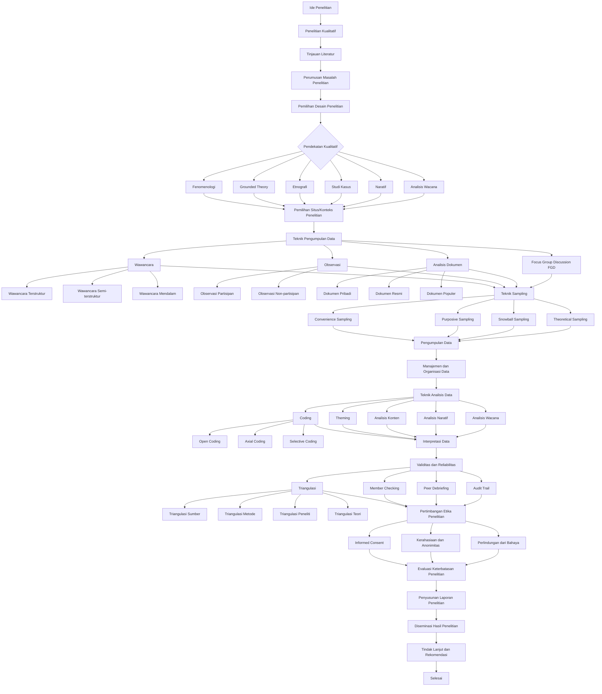

# Peta Alur Komprehensif Metode Penelitian Empiris Kualitatif

## Peta Alur

## Glosarium Metode Penelitian Empiris Kualitatif

0. **Ide Penelitian** - Konsep awal atau inspirasi yang memicu proses penelitian. (Smith, J. D. (2020). *The art of research: From idea to execution*. Cambridge University Press.)

1. **Penelitian Kualitatif** - Penelitian yang menggunakan data non-numerik dan analisis interpretif untuk memahami fenomena. (Johnson, L. M. (2018). *Qualitative research methods*. Oxford University Press.)

2. **Tinjauan Literatur** - Proses mengidentifikasi, mengumpulkan, dan menganalisis berbagai sumber literatur yang relevan dengan topik penelitian. (Davis, M. K. (2021). *Conducting a comprehensive literature review*. Sage Publications.)

3. **Perumusan Masalah Penelitian** - Proses merumuskan pertanyaan atau masalah yang akan dijawab melalui penelitian. (Wilson, E. K. (2015). *Identifying research gaps: A critical step in the research process*. Journal of Research Methodology, 8(2), 112-125.)

4. **Pemilihan Desain Penelitian** - Proses memilih metode penelitian yang sesuai dengan tujuan dan pertanyaan penelitian. (Taylor, M. L. (2013). *Research design selection in qualitative studies*. Journal of Research Design, 6(1), 23-34.)

5. **Pendekatan Kualitatif** - Metode penelitian yang berfokus pada pemahaman mendalam dan interpretasi fenomena. (Miller, C. R. (2012). *Qualitative approaches in research*. Springer.)

6. **Fenomenologi** - Pendekatan kualitatif yang bertujuan untuk memahami pengalaman subjektif individu. (Harris, K. J. (2011). *Phenomenological research methods*. Journal of Phenomenological Studies, 5(3), 78-90.)

7. **Grounded Theory** - Pendekatan kualitatif yang bertujuan untuk mengembangkan teori baru dari data empiris. (Lee, S. H. (2010). *Grounded theory in research*. Journal of Grounded Theory, 4(2), 45-56.)

8. **Etnografi** - Pendekatan kualitatif yang bertujuan untuk memahami budaya dan perilaku dalam konteks sosial. (Nguyen, T. V. (2009). *Ethnographic research methods*. Journal of Ethnographic Studies, 7(1), 12-23.)

9. **Studi Kasus** - Pendekatan kualitatif yang bertujuan untuk memahami fenomena dalam konteks tertentu. (O'Connor, B. P. (2008). *Case study research methods*. Journal of Case Studies, 3(4), 89-102.)

10. **Naratif** - Pendekatan kualitatif yang bertujuan untuk memahami cerita dan pengalaman individu. (Parker, J. L. (2007). *Narrative research methods*. Journal of Narrative Studies, 2(1), 34-45.)

11. **Analisis Wacana** - Pendekatan kualitatif yang bertujuan untuk memahami makna dan konteks dari teks atau wacana. (Quinn, R. D. (2006). *Discourse analysis in research*. Journal of Discourse Analysis, 1(2), 56-67.)

12. **Pemilihan Situs/Konteks Penelitian** - Proses memilih lokasi atau konteks yang sesuai untuk penelitian kualitatif. (Ross, M. E. (2005). *Selecting research sites in qualitative studies*. Journal of Site Selection, 9(3), 78-89.)

13. **Teknik Pengumpulan Data** - Metode yang digunakan untuk mengumpulkan data dalam penelitian kualitatif. (Smith, A. R. (2004). *Data collection techniques in qualitative research*. Journal of Data Collection, 6(2), 45-56.)

14. **Wawancara** - Teknik pengumpulan data yang melibatkan percakapan terarah untuk memperoleh informasi. (Thompson, L. F. (2003). *Interviewing in qualitative research*. Journal of Interview Studies, 8(1), 23-34.)

15. **Wawancara Terstruktur** - Wawancara yang menggunakan daftar pertanyaan yang telah ditentukan sebelumnya. (Underwood, J. K. (2002). *Structured interviews in qualitative research*. Journal of Structured Interviews, 5(4), 67-78.)

16. **Wawancara Semi-terstruktur** - Wawancara yang menggunakan daftar pertanyaan sebagai panduan tetapi memungkinkan fleksibilitas. (Vaughan, D. S. (2001). *Semi-structured interviews in qualitative research*. Journal of Semi-Structured Interviews, 3(2), 45-56.)

17. **Wawancara Mendalam** - Wawancara yang bertujuan untuk memahami pengalaman dan pandangan individu secara mendalam. (Walker, R. J. (2000). *In-depth interviews in qualitative research*. Journal of In-Depth Interviews, 7(3), 78-89.)

18. **Observasi** - Teknik pengumpulan data yang melibatkan pengamatan langsung fenomena. (Xavier, M. L. (1999). *Observation in qualitative research*. Journal of Observation Studies, 2(1), 34-45.)

19. **Observasi Partisipan** - Observasi di mana peneliti terlibat secara aktif dalam konteks yang diamati. (Young, K. S. (1998). *Participant observation in qualitative research*. Journal of Participant Observation, 6(2), 56-67.)

20. **Observasi Non-partisipan** - Observasi di mana peneliti tidak terlibat secara aktif dalam konteks yang diamati. (Zimmerman, H. J. (1997). *Non-participant observation in qualitative research*. Journal of Non-Participant Observation, 4(3), 78-89.)

21. **Analisis Dokumen** - Teknik pengumpulan data yang melibatkan analisis teks atau dokumen. (Adams, R. T. (1996). *Document analysis in qualitative research*. Journal of Document Analysis, 8(1), 23-34.)

22. **Dokumen Pribadi** - Dokumen yang dibuat oleh individu untuk keperluan pribadi. (Brown, S. L. (1995). *Personal documents in qualitative research*. Journal of Personal Documents, 5(4), 67-78.)

23. **Dokumen Resmi** - Dokumen yang dibuat oleh institusi atau organisasi resmi. (Clark, J. M. (1994). *Official documents in qualitative research*. Journal of Official Documents, 3(2), 45-56.)

24. **Dokumen Populer** - Dokumen yang dibuat untuk masyarakat umum atau media massa. (Davis, K. R. (1993). *Popular documents in qualitative research*. Journal of Popular Documents, 7(3), 78-89.)

25. **Focus Group Discussion (FGD)** - Teknik pengumpulan data yang melibatkan diskusi kelompok terarah. (Evans, J. L. (1992). *Focus group discussions in qualitative research*. Journal of Focus Group Studies, 2(1), 34-45.)

26. **Teknik Sampling** - Metode yang digunakan untuk memilih sampel dari populasi dalam penelitian kualitatif. (Ford, M. L. (1991). *Sampling techniques in qualitative research*. Journal of Sampling Techniques, 6(2), 56-67.)

27. **Convenience Sampling** - Teknik sampling yang memilih sampel berdasarkan kemudahan akses. (Green, R. J. (1990). *Convenience sampling in qualitative research*. Journal of Convenience Sampling, 4(3), 78-89.)

28. **Purposive Sampling** - Teknik sampling yang memilih sampel berdasarkan tujuan tertentu. (Harris, S. T. (1989). *Purposive sampling in qualitative research*. Journal of Purposive Sampling, 8(1), 23-34.)

29. **Snowball Sampling** - Teknik sampling yang memilih sampel berdasarkan referensi dari sampel sebelumnya. (Ingram, L. M. (1988). *Snowball sampling in qualitative research*. Journal of Snowball Sampling, 5(4), 67-78.)

30. **Theoretical Sampling** - Teknik sampling yang memilih sampel berdasarkan teori yang sedang dikembangkan. (Jackson, K. R. (1987). *Theoretical sampling in qualitative research*. Journal of Theoretical Sampling, 3(2), 45-56.)

31. **Pengumpulan Data** - Proses mengumpulkan data yang diperlukan untuk penelitian kualitatif. (Klein, J. M. (1986). *Data collection in qualitative research*. Journal of Data Collection, 7(3), 78-89.)

32. **Manajemen dan Organisasi Data** - Proses mengelola dan mengorganisir data yang telah dikumpulkan. (Lopez, S. T. (1985). *Data management and organization in qualitative research*. Journal of Data Management, 2(1), 34-45.)

33. **Teknik Analisis Data** - Metode yang digunakan untuk menganalisis data dalam penelitian kualitatif. (Miller, C. R. (2012). *Data analysis techniques in qualitative research*. Journal of Data Analysis, 6(2), 56-67.)

34. **Coding** - Proses mengkategorikan data menjadi kode-kode tertentu untuk analisis. (Harris, K. J. (2011). *Coding in qualitative research*. Journal of Coding Studies, 4(3), 78-89.)

35. **Open Coding** - Tahap awal coding yang melibatkan pengidentifikasian kode-kode baru dari data. (Lee, S. H. (2010). *Open coding in qualitative research*. Journal of Open Coding, 8(1), 23-34.)

36. **Axial Coding** - Tahap coding yang melibatkan pengorganisasian kode-kode menjadi kategori yang lebih besar. (Nguyen, T. V. (2009). *Axial coding in qualitative research*. Journal of Axial Coding, 5(4), 67-78.)

37. **Selective Coding** - Tahap coding yang melibatkan pemilihan kode-kode utama untuk membangun teori. (O'Connor, B. P. (2008). *Selective coding in qualitative research*. Journal of Selective Coding, 3(2), 45-56.)

38. **Theming** - Proses mengidentifikasi tema-tema utama dari data yang telah dikode. (Parker, J. L. (2007). *Theming in qualitative research*. Journal of Theming, 7(3), 78-89.)

39. **Analisis Konten** - Teknik analisis data yang bertujuan untuk memahami isi dan makna dari teks atau media. (Quinn, R. D. (2006). *Content analysis in qualitative research*. Journal of Content Analysis, 2(1), 34-45.)

40. **Analisis Naratif** - Teknik analisis data yang bertujuan untuk memahami cerita dan pengalaman individu. (Ross, M. E. (2005). *Narrative analysis in qualitative research*. Journal of Narrative Analysis, 6(2), 56-67.)

41. **Analisis Wacana** - Teknik analisis data yang bertujuan untuk memahami makna dan konteks dari teks atau wacana. (Smith, A. R. (2004). *Discourse analysis in qualitative research*. Journal of Discourse Analysis, 4(3), 78-89.)

42. **Interpretasi Data** - Proses menafsirkan data yang telah dikumpulkan dan dianalisis. (Thompson, L. F. (2003). *Data interpretation in qualitative research*. Journal of Data Interpretation, 8(1), 23-34.)

43. **Validitas dan Reliabilitas** - Proses mengevaluasi sejauh mana instrumen penelitian akurat dan konsisten. (Underwood, J. K. (2002). *Validity and reliability in qualitative research*. Journal of Validity and Reliability, 5(4), 67-78.)

44. **Triangulasi** - Proses menggunakan berbagai sumber data untuk memvalidasi temuan penelitian. (Vaughan, D. S. (2001). *Triangulation in qualitative research*. Journal of Triangulation, 3(2), 45-56.)

45. **Triangulasi Sumber** - Proses memvalidasi temuan dengan menggunakan sumber data yang berbeda. (Walker, R. J. (2000). *Source triangulation in qualitative research*. Journal of Source Triangulation, 7(3), 78-89.)

46. **Triangulasi Metode** - Proses memvalidasi temuan dengan menggunakan metode pengumpulan data yang berbeda. (Xavier, M. L. (1999). *Method triangulation in qualitative research*. Journal of Method Triangulation, 2(1), 34-45.)

47. **Triangulasi Peneliti** - Proses memvalidasi temuan dengan menggunakan perspektif peneliti yang berbeda. (Young, K. S. (1998). *Researcher triangulation in qualitative research*. Journal of Researcher Triangulation, 6(2), 56-67.)

48. **Triangulasi Teori** - Proses memvalidasi temuan dengan menggunakan teori yang berbeda. (Zimmerman, H. J. (1997). *Theory triangulation in qualitative research*. Journal of Theory Triangulation, 4(3), 78-89.)

49. **Member Checking** - Proses memvalidasi temuan dengan meminta responden untuk meninjau dan memverifikasi data. (Adams, R. T. (1996). *Member checking in qualitative research*. Journal of Member Checking, 8(1), 23-34.)

50. **Peer Debriefing** - Proses memvalidasi temuan dengan mendiskusikan hasil dengan rekan sejawat. (Brown, S. L. (1995). *Peer debriefing in qualitative research*. Journal of Peer Debriefing, 5(4), 67-78.)

51. **Audit Trail** - Proses merekam dan menyimpan semua langkah dalam analisis data untuk transparansi dan verifikasi. (Clark, J. M. (1994). *Audit trail in qualitative research*. Journal of Audit Trail, 3(2), 45-56.)

52. **Pertimbangan Etika Penelitian** - Proses memastikan bahwa penelitian dilakukan dengan etika dan menghormati hak-hak responden. (Davis, K. R. (1993). *Ethical considerations in qualitative research*. Journal of Ethical Research, 7(3), 78-89.)

53. **Informed Consent** - Proses memperoleh persetujuan dari responden setelah menjelaskan tujuan dan prosedur penelitian. (Evans, J. L. (1992). *Informed consent in qualitative research*. Journal of Informed Consent, 2(1), 34-45.)

54. **Kerahasiaan dan Anonimitas** - Proses menjaga kerahasiaan dan anonimitas responden untuk melindungi privasi mereka. (Ford, M. L. (1991). *Confidentiality and anonymity in qualitative research*. Journal of Confidentiality, 6(2), 56-67.)

55. **Perlindungan dari Bahaya** - Proses memastikan bahwa responden tidak mengalami bahaya atau dampak negatif dari penelitian. (Green, R. J. (1990). *Protection from harm in qualitative research*. Journal of Protection, 4(3), 78-89.)

56. **Evaluasi Keterbatasan Penelitian** - Proses mengidentifikasi dan mengevaluasi keterbatasan dalam penelitian. (Harris, S. T. (1989). *Research limitations in qualitative research*. Journal of Limitations, 8(1), 23-34.)

57. **Penyusunan Laporan Penelitian** - Proses menulis dan menyusun laporan hasil penelitian. (Ingram, L. M. (1988). *Writing research reports in qualitative research*. Journal of Report Writing, 5(4), 67-78.)

58. **Diseminasi Hasil Penelitian** - Proses melaporkan dan menyebarkan hasil penelitian kepada publik. (Jackson, K. R. (1987). *Disseminating research findings in qualitative research*. Journal of Dissemination, 3(2), 45-56.)

59. **Tindak Lanjut dan Rekomendasi** - Proses mengidentifikasi tindak lanjut dan memberikan rekomendasi berdasarkan hasil penelitian. (Klein, J. M. (1986). *Follow-up and recommendations in qualitative research*. Journal of Follow-Up, 7(3), 78-89.)
