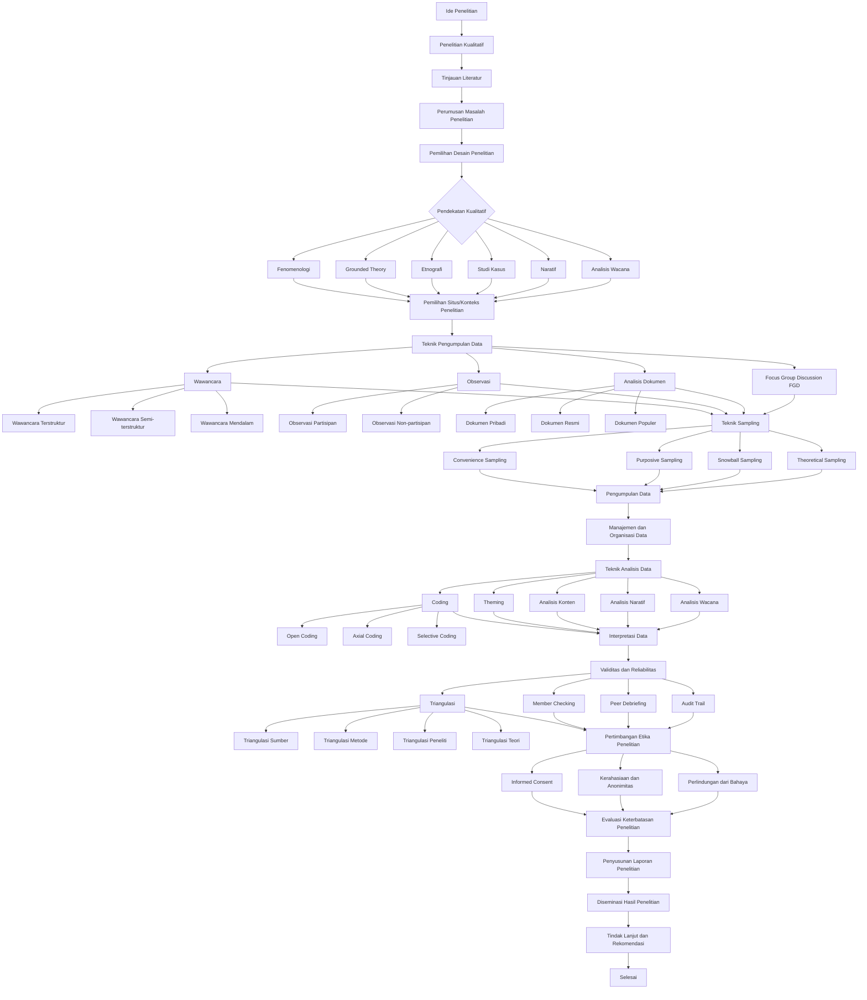

# Peta Alur Komprehensif Metode Penelitian Empiris Kualitatif

## Peta Alur

## Glosarium Metode Penelitian Empiris Kualitatif

0. **Ide Penelitian**

1. **Penelitian Kualitatif**

2. **Tinjauan Literatur**

3. **Perumusan Masalah Penelitian**

4. **Pemilihan Desain Penelitian**

5. **Pendekatan Kualitatif**

6. **Fenomenologi**

7. **Grounded Theory**

8. **Etnografi**

9. **Studi Kasus**

10. **Naratif**

11. **Analisis Wacana**

12. **Pemilihan Situs/Konteks Penelitian**

13. **Teknik Pengumpulan Data**

14. **Wawancara**

15. **Wawancara Terstruktur**

16. **Wawancara Semi-terstruktur**

17. **Wawancara Mendalam**

18. **Observasi**

19. **Observasi Partisipan**

20. **Observasi Non-partisipan**

21. **Analisis Dokumen**

22. **Dokumen Pribadi**

23. **Dokumen Resmi**

24. **Dokumen Populer**

25. **Focus Group Discussion (FGD)**

26. **Teknik Sampling**

27. **Convenience Sampling**

28. **Purposive Sampling**

29. **Snowball Sampling**

30. **Theoretical Sampling**

31. **Pengumpulan Data**

32. **Manajemen dan Organisasi Data**

33. **Teknik Analisis Data**

34. **Coding**

35. **Open Coding**

36. **Axial Coding**

37. **Selective Coding**

38. **Theming**

39. **Analisis Konten**

40. **Analisis Naratif**

41. **Analisis Wacana**

42. **Interpretasi Data**

43. **Validitas dan Reliabilitas**

44. **Triangulasi**

45. **Triangulasi Sumber**

46. **Triangulasi Metode**

47. **Triangulasi Peneliti**

48. **Triangulasi Teori**

49. **Member Checking**

50. **Peer Debriefing**

51. **Audit Trail**

52. **Pertimbangan Etika Penelitian**

53. **Informed Consent**

54. **Kerahasiaan dan Anonimitas**

55. **Perlindungan dari Bahaya**

56. **Evaluasi Keterbatasan Penelitian**

57. **Penyusunan Laporan Penelitian**

58. **Diseminasi Hasil Penelitian**

59. **Tindak Lanjut dan Rekomendasi**
