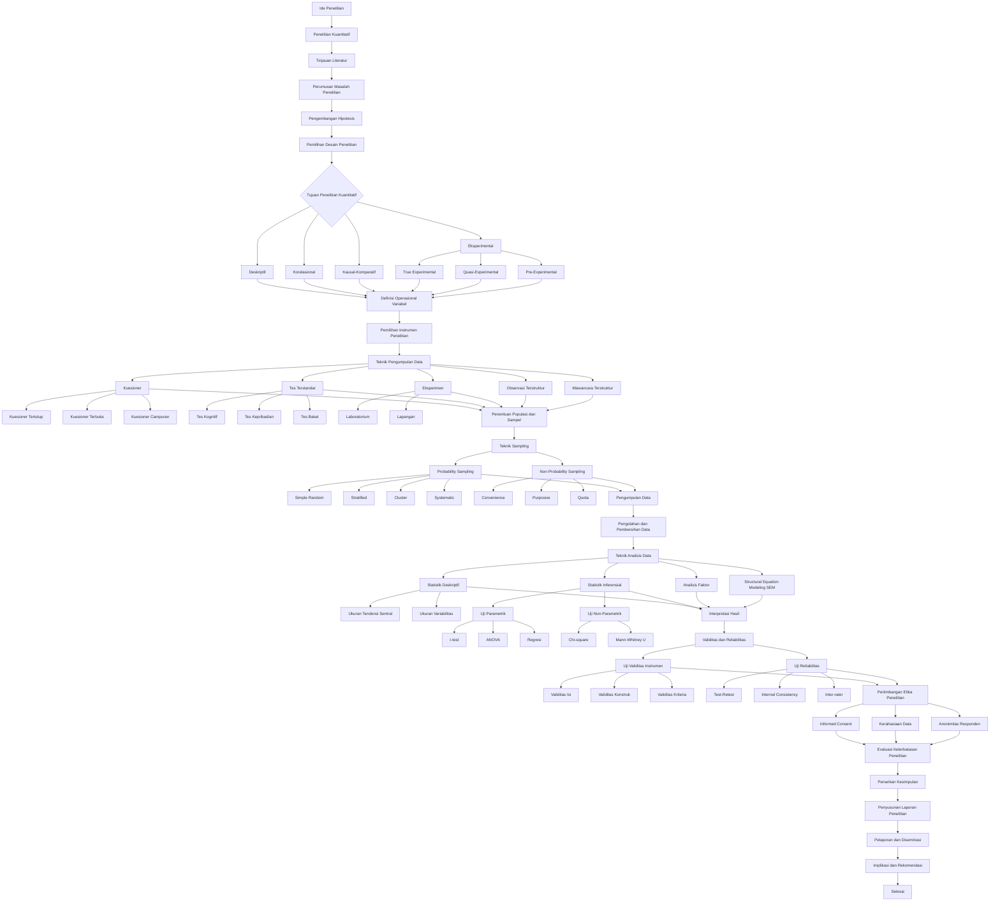

# Peta Alur Komprehensif Metode Penelitian Empiris Kuantitatif

## Peta Alur

## Glosarium Metode Penelitian Kuantitatif

0. **Ide Penelitian**

1. **Penelitian Kuantitatif**

2. **Tinjauan Literatur**

3. **Perumusan Masalah Penelitian**

4. **Pengembangan Hipotesis**

5. **Pemilihan Desain Penelitian**

6. **Tujuan Penelitian Kuantitatif**

7. **Deskriptif**

8. **Korelasional**

9. **Kausal-Komparatif**

10. **Eksperimental**

11. **True Experimental**

12. **Quasi-Experimental**

13. **Pre-Experimental**

14. **Definisi Operasional Variabel**

15. **Pemilihan Instrumen Penelitian**

16. **Teknik Pengumpulan Data**

17. **Kuesioner**

18. **Kuesioner Tertutup**

19. **Kuesioner Terbuka**

20. **Kuesioner Campuran**

21. **Tes Terstandar**

22. **Tes Kognitif**

23. **Tes Kepribadian**

24. **Tes Bakat**

25. **Eksperimen**

26. **Laboratorium**

27. **Lapangan**

28. **Observasi Terstruktur**

29. **Wawancara Terstruktur**

30. **Penentuan Populasi dan Sampel**

31. **Teknik Sampling**

32. **Probability Sampling**

33. **Simple Random**

34. **Stratified**

35. **Cluster**

36. **Systematic**

37. **Non-Probability Sampling**

38. **Convenience**

39. **Purposive**

40. **Quota**

41. **Pengumpulan Data**

42. **Pengolahan dan Pembersihan Data**

43. **Teknik Analisis Data**

44. **Statistik Deskriptif**

45. **Ukuran Tendensi Sentral**

46. **Ukuran Variabilitas**

47. **Statistik Inferensial**

48. **Uji Parametrik**

49. **t-test**

50. **ANOVA**

51. **Regresi**

52. **Uji Non-Parametrik**

53. **Chi-square**

54. **Mann-Whitney U**

55. **Analisis Faktor**

56. **Structural Equation Modeling (SEM)**

57. **Interpretasi Hasil**

58. **Validitas dan Reliabilitas**

59. **Uji Validitas Instrumen**

60. **Validitas Isi**

61. **Validitas Konstruk**

62. **Validitas Kriteria**

63. **Uji Reliabilitas**

64. **Test-Retest**

65. **Internal Consistency**

66. **Inter-rater**

67. **Pertimbangan Etika Penelitian**

68. **Informed Consent**

69. **Kerahasiaan Data**

70. **Anonimitas Responden**

71. **Evaluasi Keterbatasan Penelitian**

72. **Penarikan Kesimpulan**

73. **Penyusunan Laporan Penelitian**

74. **Pelaporan dan Diseminasi**

75. **Implikasi dan Rekomendasi**
