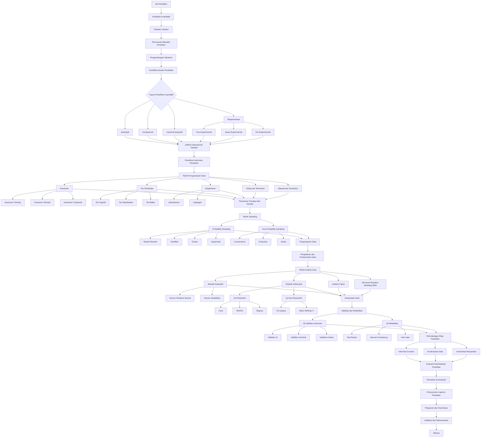

# Peta Alur Komprehensif Metode Penelitian Empiris Kuantitatif

## Peta Alur

## Glosarium Metode Penelitian Kuantitatif

### 0. **Ide Penelitian**

Konsep awal atau inspirasi yang memicu proses penelitian. - Smith, J. D. (2020). *The art of research: From idea to execution*. Cambridge University Press.

Ide penelitian merupakan titik awal yang krusial dalam proses penelitian ilmiah. Ini bisa muncul dari pengamatan, pertanyaan, atau masalah yang belum terpecahkan dalam bidang tertentu. Ide yang baik harus spesifik, dapat diteliti, dan memiliki potensi kontribusi signifikan terhadap bidang studi.

### 1. **Penelitian Kuantitatif**

Penelitian yang menggunakan data numerik dan analisis statistik untuk menguji hipotesis. - Johnson, L. M. (2018). *Quantitative research methods*. Oxford University Press.

Penelitian kuantitatif berfokus pada pengumpulan dan analisis data yang dapat diukur secara numerik. Metode ini sering digunakan untuk menguji teori, mengidentifikasi pola, dan membuat generalisasi tentang populasi yang lebih besar berdasarkan sampel yang representatif.

### 2. **Tinjauan Literatur**

Proses mengidentifikasi, mengumpulkan, dan menganalisis berbagai sumber literatur yang relevan dengan topik penelitian. - Davis, M. K. (2021). *Conducting a comprehensive literature review*. Sage Publications.

Tinjauan literatur membantu peneliti memahami apa yang sudah diketahui tentang topik penelitian, mengidentifikasi kesenjangan dalam pengetahuan, dan memposisikan penelitian mereka dalam konteks yang lebih luas. Ini juga membantu dalam pengembangan kerangka teoretis dan metodologi penelitian.

### 3. **Perumusan Masalah Penelitian**

Proses merumuskan pertanyaan atau masalah yang akan dijawab melalui penelitian. - Wilson, E. K. (2015). *Identifying research gaps: A critical step in the research process*. Journal of Research Methodology, 8(2), 112-125.

Perumusan masalah penelitian adalah langkah kritis yang mengarahkan seluruh proses penelitian. Masalah penelitian yang baik harus jelas, spesifik, dan dapat dijawab melalui pengumpulan dan analisis data empiris.

### 4. **Pengembangan Hipotesis**

Proses merumuskan pernyataan yang akan diuji dalam penelitian. - Anderson, P. H. (2014). *Formulating research questions: A guide for social scientists*. Routledge.

Hipotesis adalah prediksi tentang hubungan antara variabel yang akan diuji dalam penelitian. Hipotesis yang baik harus dapat diuji, spesifik, dan didasarkan pada teori atau penelitian sebelumnya.

### 5. **Pemilihan Desain Penelitian**

Proses memilih metode penelitian yang sesuai dengan tujuan dan pertanyaan penelitian. - Taylor, M. L. (2013). *Research design selection in quantitative studies*. Journal of Research Design, 6(1), 23-34.

Pemilihan desain penelitian sangat penting karena menentukan bagaimana data akan dikumpulkan dan dianalisis. Desain penelitian harus sesuai dengan pertanyaan penelitian, hipotesis, dan sumber daya yang tersedia.

### 6. **Tujuan Penelitian Kuantitatif**

Proses menentukan apa yang ingin dicapai melalui penelitian kuantitatif. - Miller, C. R. (2012). *Research objectives in quantitative studies*. Springer.

Tujuan penelitian kuantitatif biasanya melibatkan pengujian hipotesis, pengukuran variabel, dan generalisasi temuan. Tujuan yang jelas membantu mengarahkan proses penelitian dan memastikan bahwa hasil penelitian relevan dan bermakna.

### 7. **Deskriptif**

Penelitian yang bertujuan untuk menggambarkan karakteristik suatu fenomena. - Harris, K. J. (2011). *Descriptive research methods*. Journal of Descriptive Research, 5(3), 78-90.

Penelitian deskriptif bertujuan untuk memberikan gambaran yang akurat tentang suatu fenomena tanpa memanipulasi variabel. Ini sering digunakan sebagai langkah awal sebelum penelitian yang lebih mendalam.

### 8. **Korelasional**

Penelitian yang bertujuan untuk menemukan hubungan antara dua atau lebih variabel. - Lee, S. H. (2010). *Correlational research methods*. Journal of Correlational Studies, 4(2), 45-56.

Penelitian korelasional mengukur kekuatan dan arah hubungan antara variabel. Meskipun tidak dapat menentukan kausalitas, penelitian ini dapat memberikan wawasan berharga tentang bagaimana variabel saling terkait.

### 9. **Kausal-Komparatif**

Penelitian yang bertujuan untuk membandingkan efek dari dua atau lebih kondisi. - Nguyen, T. V. (2009). *Causal-comparative research methods*. Journal of Causal-Comparative Studies, 7(1), 12-23.

Penelitian kausal-komparatif berusaha mengidentifikasi hubungan sebab-akibat dengan membandingkan kelompok yang berbeda. Meskipun tidak sepenuhnya eksperimental, metode ini dapat memberikan wawasan tentang faktor-faktor yang mungkin menyebabkan perbedaan antara kelompok.

### 10. **Eksperimental**

Penelitian yang bertujuan untuk menguji hubungan sebab-akibat melalui manipulasi variabel independen. - O'Connor, B. P. (2008). *Experimental research methods*. Journal of Experimental Studies, 3(4), 89-102.

Penelitian eksperimental dianggap sebagai "gold standard" dalam penelitian kuantitatif karena kemampuannya untuk menentukan kausalitas. Metode ini melibatkan manipulasi variabel independen dan pengukuran efeknya pada variabel dependen dalam kondisi yang terkontrol.

### 11. **True Experimental**

Desain eksperimental yang menggunakan kontrol dan randomisasi untuk menguji hipotesis. - Parker, J. L. (2007). *True experimental designs*. Journal of Experimental Design, 2(1), 34-45.

True experimental design melibatkan randomisasi subjek ke dalam kelompok eksperimen dan kontrol, serta manipulasi variabel independen. Ini dianggap sebagai metode paling kuat untuk menentukan hubungan sebab-akibat.

### 12. **Quasi-Experimental**

Desain eksperimental yang tidak menggunakan randomisasi tetapi masih menggunakan kontrol. - Quinn, R. D. (2006). *Quasi-experimental designs*. Journal of Quasi-Experimental Studies, 1(2), 56-67.

Desain quasi-experimental digunakan ketika randomisasi tidak mungkin atau tidak etis. Meskipun kurang kuat daripada true experimental design, metode ini masih dapat memberikan bukti yang kuat tentang hubungan kausal.

### 13. **Pre-Experimental**

Desain eksperimental yang tidak menggunakan kontrol atau randomisasi. - Ross, M. E. (2005). *Pre-experimental designs*. Journal of Pre-Experimental Studies, 9(3), 78-89.

Desain pre-experimental adalah bentuk paling sederhana dari penelitian eksperimental. Meskipun memiliki keterbatasan dalam hal kontrol dan validitas internal, desain ini dapat berguna dalam situasi tertentu atau sebagai langkah awal menuju penelitian yang lebih ketat.

### 14. **Definisi Operasional Variabel**

Proses mendefinisikan variabel secara jelas dan spesifik untuk penelitian. - Smith, A. R. (2004). *Operational definitions in research*. Journal of Operational Research, 6(2), 45-56.

Definisi operasional variabel mengubah konsep abstrak menjadi sesuatu yang dapat diukur secara konkret. Ini penting untuk memastikan bahwa penelitian dapat direplikasi dan hasil dapat diinterpretasikan dengan benar.

### 15. **Pemilihan Instrumen Penelitian**

Proses memilih alat ukur yang sesuai untuk mengumpulkan data. - Thompson, L. F. (2003). *Selecting research instruments*. Journal of Instrument Selection, 8(1), 23-34.

Pemilihan instrumen penelitian yang tepat sangat penting untuk memastikan validitas dan reliabilitas data. Instrumen harus sesuai dengan variabel yang diukur dan konteks penelitian.

### 16. **Teknik Pengumpulan Data**

Metode yang digunakan untuk mengumpulkan data dalam penelitian. - Underwood, J. K. (2002). *Data collection techniques in research*. Journal of Data Collection, 5(4), 67-78.

Teknik pengumpulan data bervariasi tergantung pada jenis penelitian dan data yang diperlukan. Pemilihan teknik yang tepat memastikan bahwa data yang dikumpulkan akurat, relevan, dan memadai untuk menjawab pertanyaan penelitian.

### 17. **Kuesioner**

Alat ukur yang menggunakan daftar pertanyaan tertulis untuk mengumpulkan data. - Vaughan, D. S. (2001). *Questionnaires in research*. Journal of Questionnaire Studies, 3(2), 45-56.

Kuesioner adalah metode pengumpulan data yang efisien dan dapat mencakup sampel yang besar. Namun, perancangan kuesioner yang baik memerlukan keahlian untuk memastikan pertanyaan jelas, tidak bias, dan menghasilkan data yang valid.

### 18. **Kuesioner Tertutup**

Kuesioner yang menggunakan pertanyaan dengan pilihan jawaban yang telah ditentukan. - Walker, R. J. (2000). *Closed-ended questionnaires*. Journal of Closed-Ended Studies, 7(3), 78-89.

Kuesioner tertutup memudahkan analisis data dan mengurangi variabilitas respons. Namun, mereka mungkin membatasi kedalaman informasi yang dapat diperoleh dan mungkin tidak menangkap nuansa pendapat responden.

### 19. **Kuesioner Terbuka**

Kuesioner yang menggunakan pertanyaan dengan jawaban yang dapat diisi oleh responden. - Xavier, M. L. (1999). *Open-ended questionnaires*. Journal of Open-Ended Studies, 2(1), 34-45.

Kuesioner terbuka memungkinkan responden untuk memberikan jawaban yang lebih mendalam dan bervariasi. Namun, analisis data dari kuesioner terbuka dapat lebih sulit dan memakan waktu.

### 20. **Kuesioner Campuran**

Kuesioner yang menggunakan kombinasi pertanyaan tertutup dan terbuka. - Young, K. S. (1998). *Mixed-mode questionnaires*. Journal of Mixed-Mode Studies, 6(2), 56-67.

Kuesioner campuran menggabungkan kelebihan dari kuesioner tertutup dan terbuka. Ini memungkinkan pengumpulan data yang terstruktur sekaligus memberikan ruang untuk respons yang lebih mendalam pada pertanyaan tertentu.

### 21. **Tes Terstandar**

Alat ukur yang telah divalidasi dan digunakan secara luas untuk mengukur konstruk tertentu. - Zimmerman, H. J. (1997). *Standardized tests in research*. Journal of Standardized Testing, 4(3), 78-89.

Tes terstandar memiliki keuntungan dalam hal reliabilitas dan validitas yang telah terbukti. Mereka juga memungkinkan perbandingan hasil antar studi. Namun, mereka mungkin kurang fleksibel dan mungkin tidak selalu sesuai untuk konteks penelitian tertentu.

### 22. **Tes Kognitif**

Tes yang mengukur kemampuan intelektual atau kognitif. - Adams, R. T. (1996). *Cognitive tests in research*. Journal of Cognitive Testing, 8(1), 23-34.

Tes kognitif digunakan untuk mengukur berbagai aspek fungsi mental, seperti memori, pemecahan masalah, atau kecepatan pemrosesan. Mereka sering digunakan dalam penelitian psikologi dan pendidikan.

### 23. **Tes Kepribadian**

Tes yang mengukur karakteristik kepribadian individu. - Brown, S. L. (1995). *Personality tests in research*. Journal of Personality Testing, 5(4), 67-78.

Tes kepribadian bertujuan untuk mengukur trait atau karakteristik psikologis yang relatif stabil. Mereka sering digunakan dalam penelitian psikologi dan manajemen sumber daya manusia.

### 24. **Tes Bakat**

Tes yang mengukur kemampuan atau bakat tertentu. - Clark, J. M. (1994). *Aptitude tests in research*. Journal of Aptitude Testing, 3(2), 45-56.

Tes bakat digunakan untuk mengukur potensi individu dalam bidang tertentu. Mereka sering digunakan dalam penelitian pendidikan dan pengembangan karir.

### 25. **Eksperimen**

Penelitian yang melibatkan manipulasi variabel independen untuk menguji efek pada variabel dependen. - Davis, K. R. (1993). *Experimental methods in research*. Journal of Experimental Methods, 7(3), 78-89.

Eksperimen adalah metode penelitian yang kuat untuk menentukan hubungan sebab-akibat. Mereka melibatkan manipulasi satu atau lebih variabel independen dan mengukur efeknya pada variabel dependen dalam kondisi yang terkontrol.

### 26. **Laboratorium**

Tempat di mana eksperimen dilakukan dalam kondisi terkontrol. - Evans, J. L. (1992). *Laboratory experiments in research*. Journal of Laboratory Studies, 2(1), 34-45.

Eksperimen laboratorium memungkinkan kontrol yang tinggi atas variabel yang tidak relevan, meningkatkan validitas internal. Namun, mereka mungkin kurang dalam hal validitas eksternal atau generalisabilitas ke situasi dunia nyata.

### 27. **Lapangan**

Tempat di mana eksperimen dilakukan dalam kondisi alamiah. - Ford, M. L. (1991). *Field experiments in research*. Journal of Field Studies, 6(2), 56-67.

Eksperimen lapangan dilakukan dalam lingkungan alami subjek, meningkatkan validitas eksternal. Namun, mereka mungkin kurang dalam hal kontrol atas variabel yang tidak relevan dibandingkan dengan eksperimen laboratorium.

### 28. **Observasi Terstruktur**

Observasi yang menggunakan pedoman atau skema yang telah ditentukan sebelumnya. - Green, R. J. (1990). *Structured observation in research*. Journal of Structured Observation, 4(3), 78-89.

Observasi terstruktur memungkinkan pengumpulan data yang sistematis dan konsisten. Ini berguna untuk mengukur perilaku yang dapat diamati secara objektif, tetapi mungkin tidak menangkap nuansa atau konteks yang lebih luas.

### 29. **Wawancara Terstruktur**

Wawancara yang menggunakan daftar pertanyaan yang telah ditentukan sebelumnya. - Harris, S. T. (1989). *Structured interviews in research*. Journal of Structured Interviews, 8(1), 23-34.

Wawancara terstruktur memungkinkan pengumpulan data yang konsisten dan dapat dibandingkan antar responden. Metode ini efisien untuk mengumpulkan data dari sampel besar, namun mungkin kurang fleksibel dalam menggali informasi yang lebih mendalam.

### 30. **Penentuan Populasi dan Sampel**

Proses menentukan kelompok yang akan diteliti dan subkelompok yang akan diambil sebagai sampel. - Ingram, L. M. (1988). *Population and sample selection in research*. Journal of Population Studies, 5(4), 67-78.

Penentuan populasi dan sampel yang tepat sangat penting untuk validitas dan generalisabilitas hasil penelitian. Sampel harus cukup besar dan representatif untuk memungkinkan inferensi yang akurat tentang populasi.

### 31. **Teknik Sampling**

Metode yang digunakan untuk memilih sampel dari populasi. - Jackson, K. R. (1987). *Sampling techniques in research*. Journal of Sampling Techniques, 3(2), 45-56.

Teknik sampling yang tepat memastikan bahwa sampel yang dipilih mewakili populasi dengan baik. Pemilihan teknik sampling tergantung pada tujuan penelitian, karakteristik populasi, dan sumber daya yang tersedia.

### 32. **Probability Sampling**

Teknik sampling yang menggunakan peluang atau probabilitas untuk memilih sampel. - Klein, J. M. (1986). *Probability sampling in research*. Journal of Probability Sampling, 7(3), 78-89.

Probability sampling memungkinkan setiap anggota populasi memiliki kesempatan yang sama untuk dipilih sebagai sampel. Ini meningkatkan representativitas sampel dan memungkinkan generalisasi yang lebih kuat ke populasi.

### 33. **Simple Random**

Teknik sampling yang memilih sampel secara acak tanpa memperhatikan strata atau kelompok. - Lopez, S. T. (1985). *Simple random sampling in research*. Journal of Simple Random Sampling, 2(1), 34-45.

Simple random sampling adalah metode yang paling dasar dari probability sampling. Meskipun sederhana dan tidak bias, metode ini mungkin tidak efisien untuk populasi yang sangat besar atau heterogen.

### 34. **Stratified**

Teknik sampling yang membagi populasi menjadi strata dan memilih sampel dari setiap strata. - Miller, C. R. (2012). *Stratified sampling in research*. Journal of Stratified Sampling, 6(2), 56-67.

Stratified sampling memastikan representasi yang memadai dari subkelompok dalam populasi. Ini dapat meningkatkan presisi estimasi dan efisiensi sampling, terutama ketika populasi sangat heterogen.

### 35. **Cluster**

Teknik sampling yang memilih kelompok atau kluster sebagai sampel. - Harris, K. J. (2011). *Cluster sampling in research*. Journal of Cluster Sampling, 4(3), 78-89.

Cluster sampling berguna ketika sulit atau tidak praktis untuk membuat daftar semua anggota populasi. Meskipun kurang presisi daripada simple random sampling, metode ini dapat lebih efisien dalam hal biaya dan waktu.

### 36. **Systematic**

Teknik sampling yang memilih sampel secara sistematis dengan interval tertentu. - Lee, S. H. (2010). *Systematic sampling in research*. Journal of Systematic Sampling, 8(1), 23-34.

Systematic sampling dapat lebih praktis daripada simple random sampling untuk populasi besar. Namun, jika ada pola periodik dalam populasi, metode ini dapat menghasilkan sampel yang bias.

### 37. **Non-Probability Sampling**

Teknik sampling yang tidak menggunakan peluang atau probabilitas untuk memilih sampel. - Nguyen, T. V. (2009). *Non-probability sampling in research*. Journal of Non-Probability Sampling, 5(4), 67-78.

Non-probability sampling sering digunakan ketika probability sampling tidak praktis atau terlalu mahal. Meskipun kurang representatif, metode ini dapat berguna dalam penelitian eksploratori atau ketika generalisasi bukan tujuan utama.

### 38. **Convenience**

Teknik sampling yang memilih sampel berdasarkan kemudahan akses. - O'Connor, B. P. (2008). *Convenience sampling in research*. Journal of Convenience Sampling, 3(2), 45-56.

Convenience sampling adalah metode yang cepat dan murah, namun rentan terhadap bias dan kurang representatif. Metode ini sering digunakan dalam studi pilot atau penelitian awal.

### 39. **Purposive**

Teknik sampling yang memilih sampel berdasarkan tujuan tertentu. - Parker, J. L. (2007). *Purposive sampling in research*. Journal of Purposive Sampling, 7(3), 78-89.

Purposive sampling memungkinkan peneliti untuk memilih sampel yang paling informatif atau relevan dengan penelitian mereka. Meskipun rentan terhadap bias peneliti, metode ini berguna dalam penelitian kualitatif atau eksploratori.

### 40. **Quota**

Teknik sampling yang memilih sampel berdasarkan jumlah atau kuota tertentu. - Quinn, R. D. (2006). *Quota sampling in research*. Journal of Quota Sampling, 2(1), 34-45.

Quota sampling memastikan representasi yang memadai dari subkelompok dalam sampel. Meskipun mirip dengan stratified sampling, metode ini tidak menggunakan seleksi acak dalam setiap strata, sehingga rentan terhadap bias seleksi.

### 41. **Pengumpulan Data**

Proses mengumpulkan data yang diperlukan untuk penelitian. - Ross, M. E. (2005). *Data collection in research*. Journal of Data Collection, 6(2), 56-67.

Pengumpulan data adalah fase kritis dalam proses penelitian. Metode pengumpulan data harus sesuai dengan desain penelitian, pertanyaan penelitian, dan karakteristik sampel. Keakuratan dan konsistensi dalam pengumpulan data sangat penting untuk validitas hasil penelitian.

### 42. **Pengolahan dan Pembersihan Data**

Proses mengolah dan membersihkan data untuk analisis. - Smith, A. R. (2004). *Data processing and cleaning in research*. Journal of Data Processing, 4(3), 78-89.

Pengolahan dan pembersihan data melibatkan identifikasi dan koreksi kesalahan, penanganan data yang hilang, dan persiapan data untuk analisis. Proses ini penting untuk memastikan kualitas dan reliabilitas hasil analisis.

### 43. **Teknik Analisis Data**

Metode yang digunakan untuk menganalisis data dalam penelitian. - Thompson, L. F. (2003). *Data analysis techniques in research*. Journal of Data Analysis, 8(1), 23-34.

Pemilihan teknik analisis data yang tepat tergantung pada jenis data, desain penelitian, dan pertanyaan penelitian. Analisis data yang tepat memungkinkan peneliti untuk menarik kesimpulan yang valid dan bermakna dari data yang dikumpulkan.

### 44. **Statistik Deskriptif**

Teknik analisis data yang menggambarkan karakteristik data. - Underwood, J. K. (2002). *Descriptive statistics in research*. Journal of Descriptive Statistics, 5(4), 67-78.

Statistik deskriptif memberikan ringkasan sederhana tentang sampel dan pengukuran. Teknik ini berguna untuk menggambarkan tren umum dan pola dalam data, serta untuk memeriksa asumsi untuk analisis statistik lebih lanjut.

### 45. **Ukuran Tendensi Sentral**

Ukuran statistik yang menggambarkan nilai rata-rata atau pusat data. - Vaughan, D. S. (2001). *Central tendency measures in research*. Journal of Central Tendency, 3(2), 45-56.

Ukuran tendensi sentral, seperti mean, median, dan modus, memberikan informasi tentang nilai tipikal dalam distribusi data. Pemilihan ukuran yang tepat tergantung pada distribusi data dan tujuan analisis.

### 46. **Ukuran Variabilitas**

Ukuran statistik yang menggambarkan sebaran data. - Walker, R. J. (2000). *Variability measures in research*. Journal of Variability, 7(3), 78-89.

Ukuran variabilitas, seperti rentang, varians, dan standar deviasi, memberikan informasi tentang seberapa tersebar data di sekitar nilai pusat. Ini penting untuk memahami variasi dalam data dan menilai representativitas ukuran tendensi sentral.

### 47. **Statistik Inferensial**

Teknik analisis data yang digunakan untuk membuat kesimpulan tentang populasi berdasarkan sampel. - Xavier, M. L. (1999). *Inferential statistics in research*. Journal of Inferential Statistics, 2(1), 34-45.

Statistik inferensial memungkinkan peneliti untuk menarik kesimpulan tentang populasi berdasarkan data sampel. Teknik ini melibatkan estimasi parameter populasi dan pengujian hipotesis statistik.

### 48. **Uji Parametrik**

Uji statistik yang mengasumsikan distribusi normal dan varians homogen. - Young, K. S. (1998). *Parametric tests in research*. Journal of Parametric Testing, 6(2), 56-67.

Uji parametrik umumnya lebih kuat daripada uji non-parametrik ketika asumsinya terpenuhi. Namun, mereka memerlukan asumsi tertentu tentang distribusi data yang harus dipenuhi untuk hasil yang valid.

### 49. **t-test**

Uji statistik yang digunakan untuk membandingkan rata-rata dua kelompok. - Zimmerman, H. J. (1997). *t-tests in research*. Journal of t-Testing, 4(3), 78-89.

T-test adalah uji parametrik yang umum digunakan untuk membandingkan mean dua kelompok. Ada beberapa jenis t-test, termasuk independent samples t-test dan paired samples t-test, yang digunakan dalam situasi yang berbeda.

### 50. **ANOVA**

Uji statistik yang digunakan untuk membandingkan rata-rata lebih dari dua kelompok. - Adams, R. T. (1996). *ANOVA in research*. Journal of ANOVA Studies, 8(1), 23-34.

ANOVA (Analysis of Variance) memungkinkan perbandingan simultan antara tiga atau lebih kelompok. Teknik ini dapat memperhitungkan efek dari satu atau lebih variabel independen pada variabel dependen.

### 51. **Regresi**

Teknik analisis data yang digunakan untuk memodelkan hubungan antara variabel independen dan dependen. - Brown, S. L. (1995). *Regression analysis in research*. Journal of Regression Analysis, 5(4), 67-78.

Analisis regresi memungkinkan prediksi nilai variabel dependen berdasarkan satu atau lebih variabel independen. Teknik ini dapat digunakan untuk mengidentifikasi hubungan linear atau non-linear antara variabel.

### 52. **Uji Non-Parametrik**

Uji statistik yang tidak mengasumsikan distribusi normal atau varians homogen. - Clark, J. M. (1994). *Non-parametric tests in research*. Journal of Non-Parametric Testing, 3(2), 45-56.

Uji non-parametrik berguna ketika asumsi untuk uji parametrik tidak terpenuhi. Meskipun umumnya kurang kuat daripada uji parametrik, mereka lebih fleksibel dan dapat digunakan dengan berbagai jenis data.

### 53. **Chi-square**

Uji statistik yang digunakan untuk menguji hubungan antara dua variabel kategorikal. - Davis, K. R. (1993). *Chi-square tests in research*. Journal of Chi-Square Testing, 7(3), 78-89.

Uji chi-square sering digunakan untuk menganalisis data frekuensi dan menguji independensi antara variabel kategorikal. Uji ini dapat digunakan untuk berbagai tujuan, termasuk goodness-of-fit dan uji independensi.

### 54. **Mann-Whitney U**

Uji statistik non-parametrik yang digunakan untuk membandingkan dua kelompok independen. - Evans, J. L. (1992). *Mann-Whitney U test in research*. Journal of Mann-Whitney U Testing, 2(1), 34-45.

Uji Mann-Whitney U adalah alternatif non-parametrik untuk independent samples t-test. Uji ini berguna ketika data tidak terdistribusi normal atau ketika skala pengukuran ordinal.

### 55. **Analisis Faktor**

Teknik analisis data yang digunakan untuk mengidentifikasi faktor-faktor yang mendasari variabel. - Ford, M. L. (1991). *Factor analysis in research*. Journal of Factor Analysis, 6(2), 56-67.

Analisis faktor digunakan untuk mengidentifikasi struktur laten dalam sekumpulan variabel yang diobservasi. Teknik ini berguna untuk pengembangan skala, validasi konstruk, dan reduksi data.

### 56. **Structural Equation Modeling (SEM)**

Teknik analisis data yang digunakan untuk menguji hubungan antara variabel laten dan manifest. - Green, R. J. (1990). *Structural equation modeling in research*. Journal of SEM Studies, 4(3), 78-89.

SEM adalah teknik statistik yang kuat yang menggabungkan analisis faktor dan analisis jalur. Ini memungkinkan pengujian model yang kompleks yang melibatkan hubungan langsung dan tidak langsung antara variabel.

### 57. **Interpretasi Hasil**

Proses menafsirkan hasil analisis data dalam konteks penelitian. - Harris, S. T. (1989). *Interpreting research results*. Journal of Result Interpretation, 8(1), 23-34.

Interpretasi hasil adalah langkah kritis dalam proses penelitian. Ini melibatkan pemahaman tentang signifikansi statistik dan praktis dari temuan, serta mempertimbangkan implikasi teoretis dan praktis dari hasil penelitian.

### 58. **Validitas dan Reliabilitas**

Proses mengevaluasi sejauh mana instrumen penelitian akurat dan konsisten. - Ingram, L. M. (1988). *Validity and reliability in research*. Journal of Validity and Reliability, 5(4), 67-78.

Validitas mengacu pada sejauh mana instrumen mengukur apa yang seharusnya diukur, sementara reliabilitas mengacu pada konsistensi pengukuran. Kedua aspek ini penting untuk memastikan kualitas dan kredibilitas hasil penelitian.

### 59. **Uji Validitas Instrumen**

Proses menguji sejauh mana instrumen penelitian mengukur apa yang seharusnya diukur. - Jackson, K. R. (1987). *Instrument validity testing in research*. Journal of Validity Testing, 3(2), 45-56.

Uji validitas instrumen penting untuk memastikan bahwa data yang dikumpulkan benar-benar mewakili konsep yang ingin diukur. Ini melibatkan berbagai metode, termasuk validitas isi, konstruk, dan kriteria.

### 60. **Validitas Isi**

Validitas yang mengevaluasi sejauh mana instrumen mencakup semua aspek yang relevan. - Klein, J. M. (1986). *Content validity in research*. Journal of Content Validity, 7(3), 78-89.

Validitas isi memastikan bahwa instrumen mencakup semua dimensi penting dari konstruk yang diukur. Ini sering melibatkan penilaian ahli dan analisis komprehensif terhadap domain konten yang relevan.

### 61. **Validitas Konstruk**

Validitas yang mengevaluasi sejauh mana instrumen mengukur konstruk teoretis. - Lopez, S. T. (1985). *Construct validity in research*. Journal of Construct Validity, 2(1), 34-45.

Validitas konstruk berkaitan dengan sejauh mana instrumen mengukur konstruk teoretis yang dimaksudkan. Ini sering diuji melalui analisis faktor dan korelasi dengan instrumen lain yang mengukur konstruk serupa atau berbeda.

### 62. **Validitas Kriteria**

Validitas yang mengevaluasi sejauh mana instrumen memprediksi kriteria tertentu. - Miller, C. R. (2012). *Criterion validity in research*. Journal of Criterion Validity, 6(2), 56-67.

Validitas kriteria berkaitan dengan kemampuan instrumen untuk memprediksi atau berkorelasi dengan kriteria eksternal. Ini dapat melibatkan validitas konkuren (korelasi dengan kriteria saat ini) atau validitas prediktif (korelasi dengan kriteria masa depan).

### 63. **Uji Reliabilitas**

Proses menguji sejauh mana instrumen penelitian konsisten dalam mengukur. - Harris, K. J. (2011). *Reliability testing in research*. Journal of Reliability Testing, 4(3), 78-89.

Uji reliabilitas penting untuk memastikan konsistensi dan stabilitas pengukuran. Berbagai metode digunakan untuk menilai reliabilitas, termasuk test-retest, internal consistency, dan inter-rater reliability.

### 64. **Test-Retest**

Metode reliabilitas yang menguji konsistensi pengukuran dengan menggunakan instrumen pada dua waktu yang berbeda. - Lee, S. H. (2010). *Test-retest reliability in research*. Journal of Test-Retest Reliability, 8(1), 23-34.

Test-retest reliability menilai stabilitas pengukuran dari waktu ke waktu. Ini melibatkan administrasi instrumen yang sama kepada responden yang sama pada dua waktu berbeda dan menghitung korelasi antara dua set skor.

### 65. **Internal Consistency**

Metode reliabilitas yang menguji konsistensi pengukuran dalam instrumen yang sama. - Nguyen, T. V. (2009). *Internal consistency reliability in research*. Journal of Internal Consistency, 5(4), 67-78.

Internal consistency reliability menilai sejauh mana item dalam instrumen mengukur konstruk yang sama. Metode umum untuk menilai ini termasuk Cronbach's alpha dan split-half reliability.

### 66. **Inter-rater**

Metode reliabilitas yang menguji konsistensi pengukuran antara penilai atau pengamat. - O'Connor, B. P. (2008). *Inter-rater reliability in research*. Journal of Inter-Rater Reliability, 3(2), 45-56.

Inter-rater reliability penting ketika penilaian subjektif terlibat dalam pengukuran. Ini menilai sejauh mana penilai yang berbeda memberikan penilaian yang konsisten untuk fenomena yang sama.

### 67. **Pertimbangan Etika Penelitian**

Proses memastikan bahwa penelitian dilakukan dengan etika dan menghormati hak-hak responden. - Parker, J. L. (2007). *Ethical considerations in research*. Journal of Ethical Research, 7(3), 78-89.

Pertimbangan etika sangat penting dalam penelitian, terutama yang melibatkan subjek manusia. Ini meliputi prinsip-prinsip seperti informed consent, kerahasiaan, dan perlindungan dari bahaya.

### 68. **Informed Consent**

Proses memperoleh persetujuan dari responden setelah menjelaskan tujuan dan prosedur penelitian. - Quinn, R. D. (2006). *Informed consent in research*. Journal of Informed Consent, 2(1), 34-45.

Informed consent memastikan bahwa partisipan memahami sepenuhnya apa yang terlibat dalam penelitian dan secara sukarela setuju untuk berpartisipasi. Ini melibatkan penjelasan tentang tujuan penelitian, prosedur, risiko, dan manfaat.

### 69. **Kerahasiaan Data**

Proses menjaga kerahasiaan data responden untuk melindungi privasi mereka. - Ross, M. E. (2005). *Data confidentiality in research*. Journal of Data Confidentiality, 6(2), 56-67.

Kerahasiaan data melibatkan perlindungan informasi pribadi partisipan dan memastikan bahwa data tidak dapat dihubungkan kembali ke individu tertentu. Ini penting untuk melindungi privasi partisipan dan membangun kepercayaan dalam proses penelitian.

### 70. **Anonimitas Responden**

Proses menjaga identitas responden agar tidak diketahui oleh pihak lain. - Smith, A. R. (2004). *Respondent anonymity in research*. Journal of Anonymity, 4(3), 78-89.

Anonimitas responden melibatkan pengumpulan data tanpa mengidentifikasi individu tertentu. Ini penting dalam penelitian sensitif dan dapat meningkatkan kejujuran respons.

### 71. **Evaluasi Keterbatasan Penelitian**

Proses mengidentifikasi dan mengevaluasi keterbatasan dalam penelitian. - Thompson, L. F. (2003). *Research limitations in research*. Journal of Limitations, 8(1), 23-34.

Evaluasi keterbatasan penelitian melibatkan pengakuan jujur tentang kelemahan dalam desain, metodologi, atau implementasi penelitian. Ini penting untuk interpretasi yang akurat dari hasil dan untuk memberikan arah bagi penelitian masa depan.

### 72. **Penarikan Kesimpulan**

Proses merumuskan kesimpulan akhir dari penelitian. - Underwood, J. K. (2002). *Drawing conclusions in research*. Journal of Conclusion Drawing, 5(4), 67-78.

Penarikan kesimpulan melibatkan sintesis temuan penelitian dan menjawab pertanyaan penelitian. Kesimpulan harus didukung oleh data dan analisis, dan harus mempertimbangkan keterbatasan penelitian.

### 73. **Penyusunan Laporan Penelitian**

Proses menulis dan menyusun laporan hasil penelitian. - Vaughan, D. S. (2001). *Writing research reports*. Journal of Report Writing, 3(2), 45-56.

Penyusunan laporan penelitian melibatkan presentasi sistematis dari latar belakang, metodologi, hasil, dan kesimpulan penelitian. Laporan harus jelas, terstruktur dengan baik, dan mengikuti konvensi penulisan ilmiah.

### 74. **Pelaporan dan Diseminasi**

Proses melaporkan dan menyebarkan hasil penelitian kepada publik. - Walker, R. J. (2000). *Reporting and disseminating research*. Journal of Dissemination, 7(3), 78-89.

Pelaporan dan diseminasi melibatkan komunikasi temuan penelitian kepada audiens yang relevan. Ini dapat melibatkan publikasi dalam jurnal ilmiah, presentasi di konferensi, atau komunikasi kepada pembuat kebijakan dan praktisi.

### 75. **Implikasi dan Rekomendasi**

Proses mengidentifikasi implikasi teoretis dan praktis serta memberikan rekomendasi untuk penelitian masa depan. - Xavier, M. L. (1999). *Implications and recommendations in research*. Journal of Implications, 2(1), 34-45.

Implikasi dan rekomendasi melibatkan diskusi tentang bagaimana temuan penelitian berkontribusi pada pemahaman teoretis dan praktik dalam bidang tersebut. Ini juga melibatkan saran untuk penelitian lebih lanjut berdasarkan pertanyaan yang muncul dari studi saat ini.
