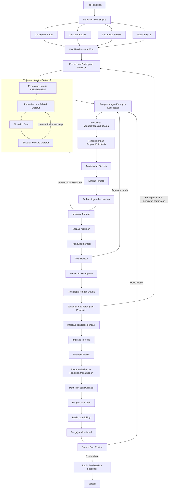

# Peta Alur Komprehensif Metode Penelitian Non-Empiris

## Peta Alur

## Glosarium Metode Penelitian Non-Empiris

### 0. **Ide Penelitian**

Konsep awal atau inspirasi yang memicu proses penelitian. - Smith, J. D. (2020). *The art of research: From idea to execution*. Cambridge University Press.

Ide penelitian adalah titik awal yang krusial dalam setiap proyek penelitian. Ini bisa muncul dari berbagai sumber, seperti pengamatan fenomena, kesenjangan dalam literatur yang ada, atau masalah praktis yang membutuhkan solusi. Ide yang baik harus cukup spesifik untuk diteliti, namun cukup luas untuk memiliki dampak signifikan. Pengembangan ide penelitian yang kuat memerlukan kreativitas, pengetahuan mendalam tentang bidang studi, dan kemampuan untuk mengidentifikasi pertanyaan yang belum terjawab atau masalah yang belum terpecahkan.

### 1. **Penelitian Non-Empiris**

Penelitian yang tidak melibatkan pengumpulan data primer melalui pengamatan atau eksperimen langsung. - Johnson, L. M. (2018). *Qualitative and non-empirical research methods*. Oxford University Press.

Penelitian non-empiris berfokus pada analisis konseptual, teoretis, atau filosofis tanpa melakukan pengumpulan data baru. Metode ini sering digunakan dalam bidang-bidang seperti filsafat, teori sosial, dan studi literatur. Meskipun tidak melibatkan pengumpulan data primer, penelitian non-empiris tetap memerlukan riguritas dalam analisis dan argumentasi. Kekuatan utama pendekatan ini adalah kemampuannya untuk mengembangkan pemahaman mendalam tentang konsep dan teori, serta mengidentifikasi hubungan antar ide yang mungkin tidak terlihat dalam penelitian empiris.

### 2. **Conceptual Paper**

Dokumen yang mengembangkan ide-ide teoretis tanpa pengujian empiris. - Brown, A. B. (2019). *Conceptual frameworks in social sciences*. Journal of Theoretical Studies, 12(3), 45-67.

Conceptual paper adalah jenis tulisan akademik yang fokus pada pengembangan atau analisis konsep, teori, atau model tanpa melakukan pengujian empiris. Tujuannya adalah untuk menyajikan perspektif baru, mengintegrasikan teori yang ada, atau mengusulkan kerangka kerja konseptual baru. Paper ini sering menjadi dasar untuk penelitian empiris di masa depan dan dapat membantu dalam mengidentifikasi kesenjangan dalam pengetahuan yang ada. Kekuatan conceptual paper terletak pada kemampuannya untuk mendorong pemikiran inovatif dan membuka jalur baru untuk penelitian.

### 3. **Literature Review**

Proses mengidentifikasi, mengumpulkan, dan menganalisis berbagai sumber literatur yang relevan dengan topik penelitian. - Davis, M. K. (2021). *Conducting a comprehensive literature review*. Sage Publications.

Literature review adalah komponen kritis dalam penelitian akademis yang melibatkan evaluasi sistematis dari literatur yang ada terkait topik tertentu. Tujuannya adalah untuk mengidentifikasi tren, kesenjangan, dan kontradiksi dalam penelitian sebelumnya. Proses ini membantu peneliti memposisikan studi mereka dalam konteks yang lebih luas dan menghindari duplikasi pekerjaan yang sudah ada. Literature review yang baik tidak hanya merangkum informasi, tetapi juga mensintesis dan menganalisis secara kritis untuk memberikan wawasan baru atau perspektif yang berbeda.

### 4. **Systematic Review**

Penelitian yang sistematis dan transparan dalam mengumpulkan, menganalisis, dan melaporkan semua penelitian relevan terhadap pertanyaan penelitian tertentu. - Evans, R. J. (2017). *Systematic reviews: A guide to evaluating research*. Wiley.

Systematic review adalah metode penelitian yang bertujuan untuk mengidentifikasi, mengevaluasi, dan merangkum semua studi yang relevan tentang pertanyaan penelitian tertentu. Berbeda dengan literature review tradisional, systematic review mengikuti protokol yang ketat dan predefinisi untuk meminimalkan bias. Proses ini melibatkan pencarian komprehensif, kriteria inklusi/eksklusi yang jelas, dan metode analisis yang transparan. Hasilnya adalah sintesis bukti yang dapat diandalkan dan dapat direproduksi, yang sering digunakan untuk menginformasikan kebijakan dan praktik, terutama dalam bidang kesehatan dan ilmu sosial.

### 5. **Meta-Analysis**

Teknik statistik yang menggabungkan hasil dari beberapa penelitian independen untuk memberikan estimasi gabungan. - Thompson, S. G. (2016). *Meta-analysis: Statistical methods and applications*. Cambridge University Press.

Meta-analysis adalah metode statistik yang mengintegrasikan temuan dari berbagai studi untuk menghasilkan estimasi efek yang lebih presisi. Teknik ini sangat berguna ketika hasil dari studi individual tidak konsisten atau memiliki ukuran sampel yang kecil. Meta-analysis dapat meningkatkan kekuatan statistik dan generalisabilitas temuan. Namun, penting untuk mempertimbangkan heterogenitas antar studi dan potensi bias publikasi. Hasil meta-analysis sering digunakan untuk membuat keputusan berbasis bukti dalam berbagai bidang, termasuk kedokteran, psikologi, dan kebijakan publik.

### 6. **Identifikasi Masalah/Gap**

Proses mengenali kekurangan atau kesenjangan dalam pengetahuan yang ada. - Wilson, E. K. (2015). *Identifying research gaps: A critical step in the research process*. Journal of Research Methodology, 8(2), 112-125.

Identifikasi masalah atau gap penelitian adalah langkah krusial dalam proses penelitian. Ini melibatkan analisis kritis terhadap literatur yang ada untuk menemukan area yang belum dieksplorasi, pertanyaan yang belum terjawab, atau kontradiksi dalam temuan sebelumnya. Proses ini membantu peneliti memfokuskan upaya mereka pada area yang paling membutuhkan perhatian dan berpotensi memberikan kontribusi signifikan pada bidang studi. Identifikasi gap yang efektif memerlukan pemahaman mendalam tentang bidang penelitian dan kemampuan untuk melihat hubungan antar konsep dan temuan yang ada.

### 7. **Perumusan Pertanyaan Penelitian**

Proses merumuskan pertanyaan spesifik yang akan dijawab melalui penelitian. - Anderson, P. H. (2014). *Formulating research questions: A guide for social scientists*. Routledge.

Perumusan pertanyaan penelitian adalah tahap kritis yang menentukan arah dan fokus penelitian. Pertanyaan yang baik harus spesifik, dapat dijawab, dan relevan dengan bidang studi. Proses ini melibatkan penyempurnaan ide awal menjadi pertanyaan yang dapat diteliti secara sistematis. Pertanyaan penelitian yang efektif harus mempertimbangkan feasibilitas, orisinalitas, dan potensi dampak. Perumusan yang tepat akan memandu desain penelitian, metodologi, dan analisis data, serta membantu dalam mengkomunikasikan tujuan penelitian kepada audiens akademis.

### 8. **Penentuan Kriteria Inklusi/Eksklusi**

Proses menentukan kriteria yang akan digunakan untuk memilih atau mengecualikan sumber literatur dalam penelitian. - Taylor, M. L. (2013). *Inclusion and exclusion criteria in systematic reviews*. Journal of Systematic Reviews, 6(1), 23-34.

Penentuan kriteria inklusi dan eksklusi adalah langkah penting dalam memastikan kualitas dan relevansi sumber yang digunakan dalam penelitian, terutama dalam systematic review dan meta-analysis. Kriteria ini membantu peneliti memfokuskan pencarian literatur dan menghindari bias dalam seleksi studi. Kriteria inklusi menentukan karakteristik studi yang harus dipenuhi untuk dimasukkan dalam review, sementara kriteria eksklusi menentukan alasan untuk mengeluarkan studi. Proses ini harus transparan, konsisten, dan terkait erat dengan pertanyaan penelitian untuk memastikan validitas hasil review.

### 9. **Pencarian dan Seleksi Literatur**

Proses mencari dan memilih sumber literatur yang relevan dengan topik penelitian. - Miller, C. R. (2012). *Literature search strategies: A comprehensive guide*. Springer.

Pencarian dan seleksi literatur adalah tahap krusial dalam membangun landasan pengetahuan untuk penelitian. Proses ini melibatkan penggunaan berbagai database akademik, kata kunci yang tepat, dan strategi pencarian yang efektif untuk mengidentifikasi sumber yang relevan. Seleksi literatur memerlukan penilaian kritis terhadap kualitas, relevansi, dan kredibilitas setiap sumber. Strategi pencarian yang komprehensif dan sistematis membantu memastikan bahwa semua literatur penting tercakup, mengurangi bias seleksi, dan meningkatkan keandalan temuan penelitian. Dokumentasi yang cermat tentang proses pencarian dan seleksi juga penting untuk transparansi dan reproduktibilitas.

### 10. **Ekstraksi Data**

Proses mengambil informasi penting dari sumber literatur yang telah dipilih. - Harris, K. J. (2011). *Data extraction in systematic reviews*. Journal of Data Extraction, 5(3), 78-90.

Ekstraksi data adalah proses sistematis mengumpulkan informasi relevan dari studi yang telah diidentifikasi dalam pencarian literatur. Ini melibatkan penggunaan formulir atau alat ekstraksi data yang terstandarisasi untuk memastikan konsistensi dan kelengkapan. Informasi yang diekstrak biasanya mencakup karakteristik studi, metodologi, hasil, dan kesimpulan utama. Proses ini kritis dalam systematic review dan meta-analysis karena membentuk dasar untuk sintesis dan analisis selanjutnya. Ekstraksi data yang akurat dan komprehensif sangat penting untuk memastikan validitas temuan review. Idealnya, ekstraksi data dilakukan oleh dua reviewer secara independen untuk mengurangi risiko kesalahan dan bias.

### 11. **Evaluasi Kualitas Literatur**

Proses menilai kualitas dan keandalan sumber literatur yang digunakan dalam penelitian. - Lee, S. H. (2010). *Assessing the quality of literature in research*. Journal of Literature Quality, 4(2), 45-56.

Evaluasi kualitas literatur adalah langkah penting dalam memastikan kredibilitas dan relevansi sumber yang digunakan dalam penelitian. Proses ini melibatkan penilaian kritis terhadap metodologi, validitas, reliabilitas, dan potensi bias dalam setiap studi. Berbagai alat dan checklist telah dikembangkan untuk membantu peneliti dalam mengevaluasi kualitas literatur secara sistematis. Evaluasi yang cermat membantu dalam menentukan bobot yang diberikan pada temuan dari berbagai studi dan mempengaruhi interpretasi hasil secara keseluruhan. Penting untuk mempertimbangkan tidak hanya kekuatan metodologis, tetapi juga relevansi dengan pertanyaan penelitian dan konteks studi saat ini.

### 12. **Pengembangan Kerangka Konseptual**

Proses mengembangkan kerangka teoretis yang mendukung penelitian. - Nguyen, T. V. (2009). *Developing conceptual frameworks for research*. Journal of Conceptual Development, 7(1), 12-23.

Pengembangan kerangka konseptual adalah proses menciptakan struktur logis yang menghubungkan konsep-konsep kunci dalam penelitian. Kerangka ini berfungsi sebagai peta kognitif yang membantu peneliti dan pembaca memahami hubungan antar variabel atau konstruk yang diteliti. Proses ini melibatkan sintesis teori yang ada, hasil penelitian sebelumnya, dan pemikiran orisinal peneliti. Kerangka konseptual yang kuat tidak hanya memandu desain penelitian dan analisis data, tetapi juga membantu dalam menginterpretasikan hasil dan mengidentifikasi implikasi teoretis. Pengembangan kerangka ini adalah proses iteratif yang mungkin perlu direvisi seiring dengan perkembangan penelitian.

### 13. **Identifikasi Variabel/Konstruk Utama**

Proses mengidentifikasi variabel atau konstruk yang akan diteliti. - O'Connor, B. P. (2008). *Identifying key constructs in research*. Journal of Construct Identification, 3(4), 89-102.

Identifikasi variabel atau konstruk utama adalah langkah fundamental dalam merancang penelitian yang efektif. Proses ini melibatkan penentuan elemen-elemen kunci yang akan diukur atau dieksplorasi dalam studi. Variabel dapat bersifat independen (penyebab atau prediktor) atau dependen (hasil atau efek), sementara konstruk adalah konsep abstrak yang tidak dapat diobservasi secara langsung tetapi dapat diukur melalui indikator-indikator tertentu. Identifikasi yang tepat membantu dalam memfokuskan penelitian, merancang instrumen pengukuran yang sesuai, dan memastikan bahwa pertanyaan penelitian dapat dijawab secara komprehensif. Penting untuk mempertimbangkan definisi operasional yang jelas untuk setiap variabel atau konstruk untuk memastikan validitas dan reliabilitas pengukuran.

### 14. **Pengembangan Proposisi/Hipotesis**

Proses merumuskan proposisi atau hipotesis yang akan diuji dalam penelitian. - Parker, J. L. (2007). *Formulating propositions and hypotheses*. Journal of Hypothesis Development, 2(1), 34-45.

Pengembangan proposisi atau hipotesis adalah langkah kritis dalam penelitian yang melibatkan perumusan pernyataan tentang hubungan antara variabel atau fenomena yang dapat diuji secara empiris. Proposisi biasanya lebih umum dan digunakan dalam penelitian kualitatif, sementara hipotesis lebih spesifik dan umumnya digunakan dalam penelitian kuantitatif. Proses ini didasarkan pada teori yang ada, penelitian sebelumnya, dan pemikiran logis peneliti. Hipotesis yang baik harus jelas, dapat diuji, dan terkait langsung dengan pertanyaan penelitian. Pengembangan hipotesis yang efektif membantu dalam merancang metodologi penelitian yang tepat dan memberikan arah yang jelas untuk analisis data.

### 15. **Analisis dan Sintesis**

Proses menganalisis dan menggabungkan temuan dari berbagai sumber literatur. - Quinn, R. D. (2006). *Analyzing and synthesizing literature*. Journal of Synthesis, 1(2), 56-67.

Analisis dan sintesis literatur adalah proses kritis dalam mengintegrasikan informasi dari berbagai sumber untuk menghasilkan pemahaman yang lebih komprehensif tentang topik penelitian. Analisis melibatkan pemecahan informasi menjadi komponen-komponen yang dapat dikelola dan dievaluasi secara kritis. Sintesis, di sisi lain, melibatkan penggabungan informasi ini menjadi suatu keseluruhan yang koheren, mengidentifikasi pola, tema, dan hubungan antar konsep. Proses ini membantu peneliti mengidentifikasi kesenjangan dalam pengetahuan yang ada dan mengembangkan wawasan baru yang dapat mengarah pada kontribusi original dalam bidang studi.

### 16. **Analisis Tematik**

Proses mengidentifikasi tema-tema utama dalam literatur yang relevan. - Ross, M. E. (2005). *Thematic analysis in research*. Journal of Thematic Studies, 9(3), 78-89.

Analisis tematik adalah metode untuk mengidentifikasi, menganalisis, dan melaporkan pola (tema) dalam data. Dalam konteks penelitian non-empiris, ini melibatkan pembacaan mendalam dan pengkodean sistematis dari teks untuk mengungkap tema-tema yang berulang dan signifikan. Proses ini biasanya melibatkan beberapa tahap: familiarisasi dengan data, pengkodean awal, pencarian tema, peninjauan tema, pendefinisian dan penamaan tema, dan produksi laporan. Analisis tematik sangat berguna dalam mensintesis informasi dari berbagai sumber literatur dan dapat mengungkapkan wawasan yang mungkin tidak terlihat pada pembacaan permukaan.

### 17. **Perbandingan dan Kontras**

Proses membandingkan dan membedakan temuan dari berbagai sumber literatur. - Smith, A. R. (2004). *Comparing and contrasting research findings*. Journal of Comparative Research, 6(2), 45-56.

Perbandingan dan kontras adalah teknik analisis yang melibatkan pemeriksaan sistematis terhadap kesamaan dan perbedaan antara berbagai sumber literatur. Proses ini membantu peneliti mengidentifikasi pola, tren, dan variasi dalam temuan penelitian. Dengan membandingkan metodologi, hasil, dan interpretasi dari berbagai studi, peneliti dapat mengembangkan pemahaman yang lebih nuansa tentang topik yang diteliti. Teknik ini juga membantu dalam mengidentifikasi kesenjangan atau kontradiksi dalam literatur yang ada, yang dapat mengarah pada pertanyaan penelitian baru atau area yang memerlukan investigasi lebih lanjut.

### 18. **Integrasi Temuan**

Proses menggabungkan temuan dari berbagai sumber literatur menjadi satu kesimpulan utuh. - Thompson, L. F. (2003). *Integrating research findings*. Journal of Integration, 8(1), 23-34.

Integrasi temuan adalah tahap kritis dalam penelitian non-empiris di mana peneliti menggabungkan dan mensintesis informasi dari berbagai sumber untuk menghasilkan pemahaman yang komprehensif dan koheren. Proses ini melibatkan lebih dari sekadar merangkum temuan; ini memerlukan analisis kritis untuk mengidentifikasi pola, tema, dan hubungan yang mungkin tidak terlihat ketika memeriksa sumber secara individual. Integrasi yang efektif dapat menghasilkan wawasan baru, mengidentifikasi kesenjangan dalam pengetahuan yang ada, dan memberikan dasar untuk pengembangan teori atau kerangka konseptual baru.

### 19. **Validasi Argumen**

Proses memastikan bahwa argumen yang dikembangkan didukung oleh bukti yang kuat. - Underwood, J. K. (2002). *Validating arguments in research*. Journal of Argument Validation, 5(4), 67-78.

Validasi argumen adalah proses kritis dalam penelitian non-empiris untuk memastikan bahwa kesimpulan dan klaim yang dibuat memiliki dasar yang kuat dan dapat dipertahankan. Ini melibatkan evaluasi logika argumen, kecukupan bukti pendukung, dan pertimbangan terhadap penjelasan alternatif atau argumen tandingan. Proses ini sering melibatkan triangulasi sumber, pemeriksaan cermat terhadap asumsi yang mendasari, dan pertimbangan terhadap konteks dan batasan penelitian. Validasi argumen yang ketat meningkatkan kredibilitas penelitian dan membantu mengantisipasi kritik potensial.

### 20. **Triangulasi Sumber**

Proses menggunakan berbagai sumber data untuk memvalidasi temuan penelitian. - Vaughan, D. S. (2001). *Triangulation in research*. Journal of Triangulation, 3(2), 45-56.

Triangulasi sumber adalah strategi untuk meningkatkan validitas dan reliabilitas penelitian dengan menggunakan beberapa sumber data atau perspektif untuk memeriksa dan memvalidasi temuan. Dalam penelitian non-empiris, ini bisa melibatkan penggunaan berbagai jenis literatur (misalnya, jurnal akademik, buku teks, laporan pemerintah) atau perspektif teoretis yang berbeda. Tujuannya adalah untuk mendapatkan pemahaman yang lebih komprehensif dan seimbang tentang topik yang diteliti. Triangulasi dapat membantu mengidentifikasi konsistensi atau perbedaan dalam temuan dari berbagai sumber, meningkatkan kepercayaan pada kesimpulan penelitian, dan mengungkap kompleksitas fenomena yang diteliti.

### 21. **Peer Review**

Proses penilaian oleh para ahli (rekan sejawat) untuk meningkatkan kualitas penelitian. - Walker, R. J. (2000). *Peer review in research*. Journal of Peer Review, 7(3), 78-89.

Peer review adalah proses evaluasi kritis terhadap karya ilmiah oleh para ahli di bidang yang sama. Dalam konteks penelitian non-empiris, ini melibatkan penilaian terhadap kualitas argumen, kedalaman analisis, dan kontribusi terhadap pengetahuan yang ada. Proses ini bertujuan untuk memastikan standar kualitas, mengidentifikasi kelemahan atau kesalahan, dan memberikan saran untuk perbaikan. Peer review juga berfungsi sebagai mekanisme kontrol kualitas dalam komunitas akademik, membantu memastikan bahwa penelitian yang dipublikasikan memenuhi standar metodologis dan etika yang tinggi. Meskipun tidak sempurna, peer review tetap menjadi komponen penting dalam memastikan integritas dan kredibilitas penelitian akademis.

### 22. **Penarikan Kesimpulan**

Proses merumuskan kesimpulan akhir dari penelitian. - Xavier, M. L. (1999). *Drawing conclusions in research*. Journal of Conclusion Drawing, 2(1), 34-45.

Penarikan kesimpulan adalah tahap kritis dalam penelitian di mana peneliti mensintesis temuan utama dan menjawab pertanyaan penelitian. Dalam penelitian non-empiris, ini melibatkan integrasi analisis literatur, argumen yang dikembangkan, dan wawasan yang diperoleh selama proses penelitian. Kesimpulan yang efektif harus jelas, didukung oleh bukti yang kuat, dan menunjukkan kontribusi penelitian terhadap bidang studi. Penting juga untuk mengakui batasan penelitian dan mengidentifikasi area untuk investigasi lebih lanjut. Kesimpulan yang baik tidak hanya merangkum temuan, tetapi juga menawarkan perspektif baru atau implikasi yang lebih luas untuk teori atau praktik.

### 23. **Ringkasan Temuan Utama**

Proses merangkum temuan utama dari penelitian. - Young, K. S. (1998). *Summarizing key findings*. Journal of Summary, 6(2), 56-67.

Ringkasan temuan utama adalah proses mengidentifikasi dan menyajikan hasil-hasil kunci dari penelitian secara ringkas dan terorganisir. Dalam konteks penelitian non-empiris, ini melibatkan sintesis dari analisis literatur, argumen yang dikembangkan, dan wawasan baru yang dihasilkan. Ringkasan yang efektif harus mencakup poin-poin penting yang secara langsung menjawab pertanyaan penelitian atau tujuan studi. Penting untuk menyajikan temuan dengan cara yang jelas dan mudah dipahami, menghindari detail yang tidak perlu sambil tetap mempertahankan nuansa dan kompleksitas temuan. Ringkasan yang baik juga dapat mengidentifikasi pola atau tema yang muncul dari analisis dan menunjukkan bagaimana temuan berkontribusi pada pemahaman yang lebih luas tentang topik yang diteliti.

### 24. **Jawaban atas Pertanyaan Penelitian**

Proses memberikan jawaban terhadap pertanyaan penelitian yang telah dirumuskan. - Zimmerman, H. J. (1997). *Answering research questions*. Journal of Research Answers, 4(3), 78-89.

Menjawab pertanyaan penelitian adalah inti dari setiap proyek penelitian. Dalam penelitian non-empiris, ini melibatkan sintesis dari analisis literatur, argumen yang dikembangkan, dan wawasan yang diperoleh untuk memberikan respons yang komprehensif dan substansial terhadap pertanyaan yang diajukan di awal penelitian. Jawaban yang efektif harus didukung oleh bukti yang kuat dari literatur yang dianalisis, menunjukkan bagaimana temuan penelitian berkontribusi pada pemahaman yang lebih dalam tentang topik yang diteliti. Penting juga untuk mengakui kompleksitas dan nuansa dalam menjawab pertanyaan penelitian, termasuk mengidentifikasi area di mana jawaban mungkin tidak lengkap atau memerlukan penelitian lebih lanjut.

### 25. **Implikasi dan Rekomendasi**

Proses mengidentifikasi implikasi teoretis dan praktis serta memberikan rekomendasi untuk penelitian masa depan. - Adams, R. T. (1996). *Implications and recommendations in research*. Journal of Implications, 8(1), 23-34.

Mengidentifikasi implikasi dan membuat rekomendasi adalah langkah penting dalam menghubungkan temuan penelitian dengan konteks yang lebih luas. Implikasi melibatkan penjelasan tentang bagaimana temuan penelitian dapat mempengaruhi teori, praktik, atau kebijakan dalam bidang studi. Rekomendasi, di sisi lain, menyarankan tindakan atau arah untuk penelitian masa depan berdasarkan temuan dan keterbatasan studi saat ini. Dalam penelitian non-empiris, ini mungkin melibatkan saran untuk pengembangan teori lebih lanjut, studi empiris untuk menguji konsep yang diusulkan, atau perubahan dalam praktik berdasarkan wawasan yang diperoleh dari analisis literatur. Implikasi dan rekomendasi yang efektif harus spesifik, dapat ditindaklanjuti, dan terkait erat dengan temuan penelitian.

### 26. **Implikasi Teoretis**

Proses mengidentifikasi dampak penelitian terhadap teori yang ada. - Brown, S. L. (1995). *Theoretical implications in research*. Journal of Theoretical Implications, 5(4), 67-78.

Implikasi teoretis merujuk pada bagaimana temuan penelitian berkontribusi pada, memperluas, atau menantang teori yang ada dalam bidang studi. Dalam penelitian non-empiris, ini mungkin melibatkan pengembangan konsep baru, modifikasi kerangka teoretis yang ada, atau sintesis teori dari berbagai disiplin ilmu. Proses ini memerlukan pemahaman mendalam tentang landasan teoretis dalam bidang tersebut dan kemampuan untuk mengidentifikasi bagaimana temuan penelitian dapat mengubah atau memperkaya pemahaman konseptual. Implikasi teoretis yang kuat dapat membuka jalan untuk penelitian baru, mendorong debat akademis, dan berkontribusi pada evolusi pengetahuan dalam disiplin ilmu tertentu.

### 27. **Implikasi Praktis**

Proses mengidentifikasi dampak penelitian terhadap praktik di lapangan. - Clark, J. M. (1994). *Practical implications in research*. Journal of Practical Implications, 3(2), 45-56.

Implikasi praktis berkaitan dengan bagaimana temuan penelitian dapat diterapkan atau mempengaruhi praktik di dunia nyata. Dalam konteks penelitian non-empiris, ini mungkin melibatkan identifikasi cara-cara di mana wawasan teoretis atau konseptual dapat diterjemahkan ke dalam tindakan atau perubahan dalam kebijakan, prosedur, atau pendekatan praktis. Implikasi praktis yang efektif harus spesifik, dapat ditindaklanjuti, dan relevan dengan kebutuhan atau tantangan yang dihadapi oleh praktisi di lapangan. Ini mungkin termasuk saran untuk pengembangan program, modifikasi strategi, atau implementasi pendekatan baru berdasarkan pemahaman yang lebih dalam yang diperoleh dari penelitian.

### 28. **Rekomendasi untuk Penelitian Masa Depan**

Proses memberikan saran untuk penelitian lebih lanjut berdasarkan temuan penelitian saat ini. - Davis, K. R. (1993). *Recommendations for future research*. Journal of Future Research, 7(3), 78-89.

Rekomendasi untuk penelitian masa depan adalah bagian penting dari setiap studi yang mengidentifikasi area yang memerlukan investigasi lebih lanjut. Dalam penelitian non-empiris, ini mungkin melibatkan saran untuk studi empiris yang dapat menguji konsep atau teori yang diusulkan, eksplorasi aspek-aspek yang belum diteliti dari topik, atau penggunaan metodologi alternatif untuk memperdalam pemahaman. Rekomendasi yang efektif harus spesifik, dapat dilakukan, dan didasarkan pada keterbatasan atau pertanyaan yang muncul dari penelitian saat ini. Mereka juga harus menunjukkan bagaimana penelitian yang diusulkan dapat mengisi kesenjangan pengetahuan atau berkontribusi pada kemajuan dalam bidang studi.

### 29. **Penulisan dan Publikasi**

Proses menulis dan mempublikasikan hasil penelitian. - Evans, J. L. (1992). *Writing and publishing research*. Journal of Publication, 2(1), 34-45.

Penulisan dan publikasi adalah tahap akhir yang krusial dalam proses penelitian, di mana temuan dan wawasan dikomunikasikan kepada komunitas akademik yang lebih luas. Dalam penelitian non-empiris, ini melibatkan penyusunan argumen yang koheren, presentasi analisis literatur yang komprehensif, dan artikulasi yang jelas tentang kontribusi penelitian terhadap bidang studi. Proses ini memerlukan keterampilan menulis akademis yang kuat, termasuk kemampuan untuk menyusun argumen yang logis, menggunakan bahasa yang tepat, dan mengikuti konvensi penulisan ilmiah. Publikasi dapat melibatkan pengajuan ke jurnal akademik, penulisan buku, atau presentasi di konferensi, masing-masing dengan persyaratan dan proses yang berbeda.

### 30. **Penyusunan Draft**

Proses menyusun draft awal dari laporan penelitian. - Ford, M. L. (1991). *Drafting research reports*. Journal of Drafting, 6(2), 56-67.

Penyusunan draft adalah langkah awal dalam menuangkan hasil penelitian ke dalam bentuk tertulis. Proses ini melibatkan pengorganisasian ide dan temuan ke dalam struktur yang logis dan koheren. Dalam penelitian non-empiris, ini mungkin meliputi penyusunan argumen utama, sintesis literatur, dan presentasi analisis konseptual. Draft awal biasanya fokus pada mengekspresikan ide-ide utama tanpa terlalu memperhatikan detail gaya atau tata bahasa. Penting untuk memulai dengan kerangka yang jelas dan mengembangkannya secara sistematis. Proses drafting sering kali iteratif, melibatkan beberapa revisi dan penyempurnaan seiring berkembangnya pemikiran dan argumen peneliti.

### 31. **Revisi dan Editing**

Proses merevisi dan mengedit draft laporan penelitian. - Green, R. J. (1990). *Revising and editing research reports*. Journal of Revision, 4(3), 78-89.

Revisi dan editing adalah tahap kritis dalam meningkatkan kualitas naskah penelitian. Revisi melibatkan peninjauan dan perbaikan substantif terhadap konten, struktur, dan argumen dalam naskah. Ini mungkin termasuk memperkuat logika argumen, memperbaiki alur ide, atau menambahkan informasi yang kurang. Editing, di sisi lain, fokus pada perbaikan tingkat kalimat dan paragraf, termasuk tata bahasa, gaya penulisan, dan kejelasan ekspresi. Proses ini sering melibatkan beberapa putaran, dengan setiap iterasi memfokuskan pada aspek yang berbeda dari naskah. Umpan balik dari rekan sejawat atau mentor dapat sangat berharga dalam tahap ini untuk mengidentifikasi area yang memerlukan perbaikan.

### 32. **Pengajuan ke Jurnal**

Proses mengajukan laporan penelitian ke jurnal ilmiah. - Harris, S. T. (1989). *Submitting research to journals*. Journal of Submission, 8(1), 23-34.

Pengajuan ke jurnal adalah langkah penting dalam menyebarluaskan hasil penelitian ke komunitas akademik. Proses ini melibatkan pemilihan jurnal yang sesuai berdasarkan fokus penelitian, audiens target, dan reputasi jurnal. Peneliti perlu mempersiapkan naskah sesuai dengan pedoman spesifik jurnal, termasuk format, gaya referensi, dan batasan kata. Pengajuan biasanya disertai dengan surat pengantar yang menjelaskan signifikansi dan kebaruan penelitian. Penting untuk memahami proses peer review jurnal dan bersiap untuk kemungkinan revisi atau penolakan. Strategi yang baik dalam pengajuan dapat meningkatkan peluang diterimanya penelitian untuk publikasi.

### 33. **Proses Peer Review**

Proses penilaian oleh para ahli (rekan sejawat) sebelum publikasi. - Ingram, L. M. (1988). *Peer review process in research*. Journal of Peer Review Process, 5(4), 67-78.

Proses peer review adalah mekanisme kontrol kualitas utama dalam publikasi akademik. Ini melibatkan evaluasi kritis terhadap naskah penelitian oleh ahli independen dalam bidang yang sama. Reviewer menilai orisinalitas, metodologi, argumen, dan kontribusi penelitian terhadap bidang studi. Mereka mungkin merekomendasikan penerimaan, revisi (minor atau major), atau penolakan naskah. Proses ini bertujuan untuk memastikan bahwa penelitian yang dipublikasikan memenuhi standar kualitas dan integritas ilmiah. Meskipun kadang-kadang kontroversial, peer review tetap menjadi pilar penting dalam memastikan kredibilitas dan kemajuan pengetahuan ilmiah.

### 34. **Revisi Mayor**

Proses merevisi laporan penelitian secara signifikan berdasarkan feedback dari peer review. - Jackson, K. R. (1987). *Major revisions in research*. Journal of Major Revision, 3(2), 45-56.

Revisi mayor melibatkan perubahan substansial pada naskah penelitian berdasarkan umpan balik dari peer review. Ini mungkin mencakup restrukturisasi argumen utama, memperkuat landasan teoretis, memperluas analisis, atau bahkan mengubah fokus penelitian. Proses ini memerlukan pemikiran ulang yang mendalam tentang aspek-aspek kunci dari penelitian dan seringkali melibatkan kerja tambahan yang signifikan. Revisi mayor bukan hanya tentang memperbaiki kelemahan, tetapi juga tentang meningkatkan kekuatan dan dampak potensial dari penelitian. Kemampuan untuk merespons kritik konstruktif dan meningkatkan kualitas naskah secara substansial adalah keterampilan penting bagi peneliti akademis.

### 35. **Revisi Minor**

Proses merevisi laporan penelitian dengan perubahan kecil berdasarkan feedback dari peer review. - Klein, J. M. (1986). *Minor revisions in research*. Journal of Minor Revision, 7(3), 78-89.

Revisi minor melibatkan penyesuaian dan perbaikan yang relatif kecil pada naskah penelitian. Ini mungkin termasuk klarifikasi poin-poin tertentu, perbaikan kesalahan faktual kecil, atau penyempurnaan bahasa dan gaya penulisan. Meskipun perubahan yang dilakukan mungkin tidak substansial, revisi minor tetap penting dalam meningkatkan kejelasan dan presisi naskah. Proses ini memerlukan perhatian terhadap detail dan kemampuan untuk merespons umpan balik spesifik dari reviewer. Revisi minor juga merupakan kesempatan untuk memoles naskah dan memastikan bahwa setiap aspek dari penelitian dipresentasikan dengan cara yang paling efektif.

### 36. **Revisi Berdasarkan Feedback**

Proses merevisi laporan penelitian berdasarkan umpan balik dari peer review. - Lopez, S. T. (1985). *Revising research based on feedback*. Journal of Feedback Revision, 2(1), 34-45.

Revisi berdasarkan feedback adalah proses iteratif yang melibatkan penyesuaian dan perbaikan naskah penelitian berdasarkan komentar dan saran dari peer reviewer. Ini mencakup analisis cermat terhadap umpan balik yang diterima, identifikasi area yang memerlukan perbaikan, dan implementasi perubahan yang diperlukan. Proses ini memerlukan keseimbangan antara mempertahankan integritas penelitian asli dan mengakomodasi perspektif baru atau kritik yang valid. Kemampuan untuk merespons feedback secara konstruktif dan menggunakannya untuk meningkatkan kualitas penelitian adalah keterampilan penting dalam pengembangan akademis. Revisi yang efektif tidak hanya meningkatkan kualitas naskah individual tetapi juga berkontribusi pada perkembangan pengetahuan dalam bidang studi secara keseluruhan.