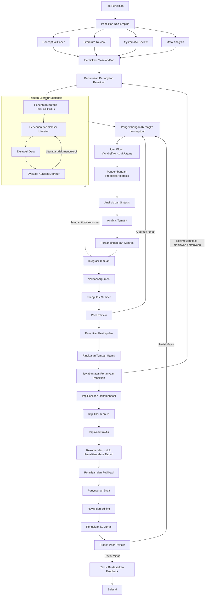

# Peta Alur Komprehensif Metode Penelitian Non-Empiris

## Peta Alur

## Glosarium Metode Penelitian Non-Empiris

0. **Ide Penelitian**

1. **Penelitian Non-Empiris**

2. **Conceptual Paper**

3. **Literature Review**

4. **Systematic Review**

5. **Meta-Analysis**

6. **Identifikasi Masalah/Gap**

7. **Perumusan Pertanyaan Penelitian**

8. **Penentuan Kriteria Inklusi/Eksklusi**

9. **Pencarian dan Seleksi Literatur**

10. **Ekstraksi Data**

11. **Evaluasi Kualitas Literatur**

12. **Pengembangan Kerangka Konseptual**

13. **Identifikasi Variabel/Konstruk Utama**

14. **Pengembangan Proposisi/Hipotesis**

15. **Analisis dan Sintesis**

16. **Analisis Tematik**

17. **Perbandingan dan Kontras**

18. **Integrasi Temuan**

19. **Validasi Argumen**

20. **Triangulasi Sumber**

21. **Peer Review**

22. **Penarikan Kesimpulan**

23. **Ringkasan Temuan Utama**

24. **Jawaban atas Pertanyaan Penelitian**

25. **Implikasi dan Rekomendasi**

26. **Implikasi Teoretis**

27. **Implikasi Praktis**

28. **Rekomendasi untuk Penelitian Masa Depan**

29. **Penulisan dan Publikasi**

30. **Penyusunan Draft**

31. **Revisi dan Editing**

32. **Pengajuan ke Jurnal**

33. **Proses Peer Review**

34. **Revisi Mayor**

35. **Revisi Minor**

36. **Revisi Berdasarkan Feedback**
