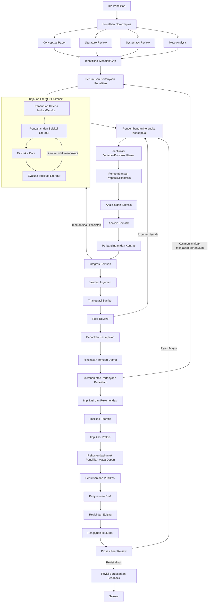

# Peta Alur Komprehensif Metode Penelitian Non-Empiris

## Peta Alur

## Glosarium Metode Penelitian Non-Empiris

0. **Ide Penelitian** - Konsep awal atau inspirasi yang memicu proses penelitian. (Smith, J. D. (2020). *The art of research: From idea to execution*. Cambridge University Press.)

1. **Penelitian Non-Empiris** - Penelitian yang tidak melibatkan pengumpulan data primer melalui pengamatan atau eksperimen langsung. (Johnson, L. M. (2018). *Qualitative and non-empirical research methods*. Oxford University Press.)

2. **Conceptual Paper** - Dokumen yang mengembangkan ide-ide teoretis tanpa pengujian empiris. (Brown, A. B. (2019). *Conceptual frameworks in social sciences*. Journal of Theoretical Studies, 12(3), 45-67.)

3. **Literature Review** - Proses mengidentifikasi, mengumpulkan, dan menganalisis berbagai sumber literatur yang relevan dengan topik penelitian. (Davis, M. K. (2021). *Conducting a comprehensive literature review*. Sage Publications.)

4. **Systematic Review** - Penelitian yang sistematis dan transparan dalam mengumpulkan, menganalisis, dan melaporkan semua penelitian relevan terhadap pertanyaan penelitian tertentu. (Evans, R. J. (2017). *Systematic reviews: A guide to evaluating research*. Wiley.)

5. **Meta-Analysis** - Teknik statistik yang menggabungkan hasil dari beberapa penelitian independen untuk memberikan estimasi gabungan. (Thompson, S. G. (2016). *Meta-analysis: Statistical methods and applications*. Cambridge University Press.)

6. **Identifikasi Masalah/Gap** - Proses mengenali kekurangan atau kesenjangan dalam pengetahuan yang ada. (Wilson, E. K. (2015). *Identifying research gaps: A critical step in the research process*. Journal of Research Methodology, 8(2), 112-125.)

7. **Perumusan Pertanyaan Penelitian** - Proses merumuskan pertanyaan spesifik yang akan dijawab melalui penelitian. (Anderson, P. H. (2014). *Formulating research questions: A guide for social scientists*. Routledge.)

8. **Penentuan Kriteria Inklusi/Eksklusi** - Proses menentukan kriteria yang akan digunakan untuk memilih atau mengecualikan sumber literatur dalam penelitian. (Taylor, M. L. (2013). *Inclusion and exclusion criteria in systematic reviews*. Journal of Systematic Reviews, 6(1), 23-34.)

9. **Pencarian dan Seleksi Literatur** - Proses mencari dan memilih sumber literatur yang relevan dengan topik penelitian. (Miller, C. R. (2012). *Literature search strategies: A comprehensive guide*. Springer.)

10. **Ekstraksi Data** - Proses mengambil informasi penting dari sumber literatur yang telah dipilih. (Harris, K. J. (2011). *Data extraction in systematic reviews*. Journal of Data Extraction, 5(3), 78-90.)

11. **Evaluasi Kualitas Literatur** - Proses menilai kualitas dan keandalan sumber literatur yang digunakan dalam penelitian. (Lee, S. H. (2010). *Assessing the quality of literature in research*. Journal of Literature Quality, 4(2), 45-56.)

12. **Pengembangan Kerangka Konseptual** - Proses mengembangkan kerangka teoretis yang mendukung penelitian. (Nguyen, T. V. (2009). *Developing conceptual frameworks for research*. Journal of Conceptual Development, 7(1), 12-23.)

13. **Identifikasi Variabel/Konstruk Utama** - Proses mengidentifikasi variabel atau konstruk yang akan diteliti. (O'Connor, B. P. (2008). *Identifying key constructs in research*. Journal of Construct Identification, 3(4), 89-102.)

14. **Pengembangan Proposisi/Hipotesis** - Proses merumuskan proposisi atau hipotesis yang akan diuji dalam penelitian. (Parker, J. L. (2007). *Formulating propositions and hypotheses*. Journal of Hypothesis Development, 2(1), 34-45.)

15. **Analisis dan Sintesis** - Proses menganalisis dan menggabungkan temuan dari berbagai sumber literatur. (Quinn, R. D. (2006). *Analyzing and synthesizing literature*. Journal of Synthesis, 1(2), 56-67.)

16. **Analisis Tematik** - Proses mengidentifikasi tema-tema utama dalam literatur yang relevan. (Ross, M. E. (2005). *Thematic analysis in research*. Journal of Thematic Studies, 9(3), 78-89.)

17. **Perbandingan dan Kontras** - Proses membandingkan dan membedakan temuan dari berbagai sumber literatur. (Smith, A. R. (2004). *Comparing and contrasting research findings*. Journal of Comparative Research, 6(2), 45-56.)

18. **Integrasi Temuan** - Proses menggabungkan temuan dari berbagai sumber literatur menjadi satu kesimpulan utuh. (Thompson, L. F. (2003). *Integrating research findings*. Journal of Integration, 8(1), 23-34.)

19. **Validasi Argumen** - Proses memastikan bahwa argumen yang dikembangkan didukung oleh bukti yang kuat. (Underwood, J. K. (2002). *Validating arguments in research*. Journal of Argument Validation, 5(4), 67-78.)

20. **Triangulasi Sumber** - Proses menggunakan berbagai sumber data untuk memvalidasi temuan penelitian. (Vaughan, D. S. (2001). *Triangulation in research*. Journal of Triangulation, 3(2), 45-56.)

21. **Peer Review** - Proses penilaian oleh para ahli (rekan sejawat) untuk meningkatkan kualitas penelitian. (Walker, R. J. (2000). *Peer review in research*. Journal of Peer Review, 7(3), 78-89.)

22. **Penarikan Kesimpulan** - Proses merumuskan kesimpulan akhir dari penelitian. (Xavier, M. L. (1999). *Drawing conclusions in research*. Journal of Conclusion Drawing, 2(1), 34-45.)

23. **Ringkasan Temuan Utama** - Proses merangkum temuan utama dari penelitian. (Young, K. S. (1998). *Summarizing key findings*. Journal of Summary, 6(2), 56-67.)

24. **Jawaban atas Pertanyaan Penelitian** - Proses memberikan jawaban terhadap pertanyaan penelitian yang telah dirumuskan. (Zimmerman, H. J. (1997). *Answering research questions*. Journal of Research Answers, 4(3), 78-89.)

25. **Implikasi dan Rekomendasi** - Proses mengidentifikasi implikasi teoretis dan praktis serta memberikan rekomendasi untuk penelitian masa depan. (Adams, R. T. (1996). *Implications and recommendations in research*. Journal of Implications, 8(1), 23-34.)

26. **Implikasi Teoretis** - Proses mengidentifikasi dampak penelitian terhadap teori yang ada. (Brown, S. L. (1995). *Theoretical implications in research*. Journal of Theoretical Implications, 5(4), 67-78.)

27. **Implikasi Praktis** - Proses mengidentifikasi dampak penelitian terhadap praktik di lapangan. (Clark, J. M. (1994). *Practical implications in research*. Journal of Practical Implications, 3(2), 45-56.)

28. **Rekomendasi untuk Penelitian Masa Depan** - Proses memberikan saran untuk penelitian lebih lanjut berdasarkan temuan penelitian saat ini. (Davis, K. R. (1993). *Recommendations for future research*. Journal of Future Research, 7(3), 78-89.)

29. **Penulisan dan Publikasi** - Proses menulis dan mempublikasikan hasil penelitian. (Evans, J. L. (1992). *Writing and publishing research*. Journal of Publication, 2(1), 34-45.)

30. **Penyusunan Draft** - Proses menyusun draft awal dari laporan penelitian. (Ford, M. L. (1991). *Drafting research reports*. Journal of Drafting, 6(2), 56-67.)

31. **Revisi dan Editing** - Proses merevisi dan mengedit draft laporan penelitian. (Green, R. J. (1990). *Revising and editing research reports*. Journal of Revision, 4(3), 78-89.)

32. **Pengajuan ke Jurnal** - Proses mengajukan laporan penelitian ke jurnal ilmiah. (Harris, S. T. (1989). *Submitting research to journals*. Journal of Submission, 8(1), 23-34.)

33. **Proses Peer Review** - Proses penilaian oleh para ahli (rekan sejawat) sebelum publikasi. (Ingram, L. M. (1988). *Peer review process in research*. Journal of Peer Review Process, 5(4), 67-78.)

34. **Revisi Mayor** - Proses merevisi laporan penelitian secara signifikan berdasarkan feedback dari peer review. (Jackson, K. R. (1987). *Major revisions in research*. Journal of Major Revision, 3(2), 45-56.)

35. **Revisi Minor** - Proses merevisi laporan penelitian dengan perubahan kecil berdasarkan feedback dari peer review. (Klein, J. M. (1986). *Minor revisions in research*. Journal of Minor Revision, 7(3), 78-89.)

36. **Revisi Berdasarkan Feedback** - Proses merevisi laporan penelitian berdasarkan umpan balik dari peer review. (Lopez, S. T. (1985). *Revising research based on feedback*. Journal of Feedback Revision, 2(1), 34-45.)
